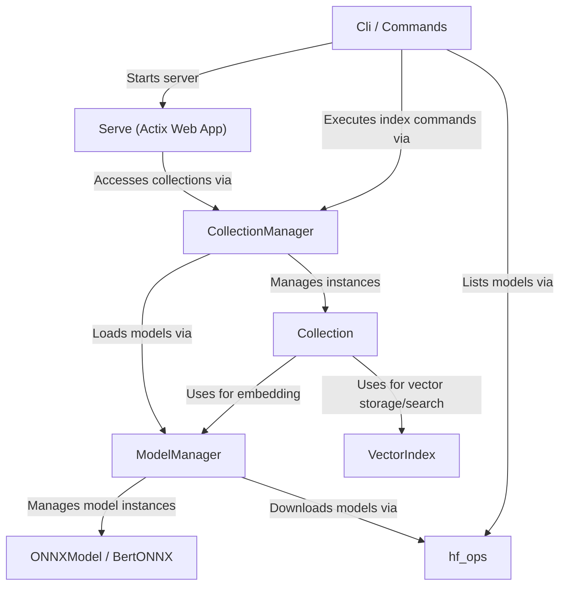
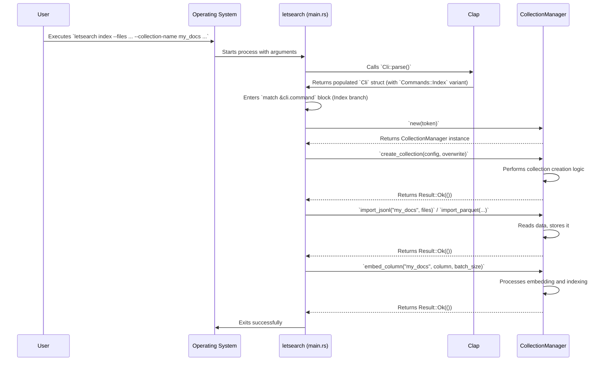
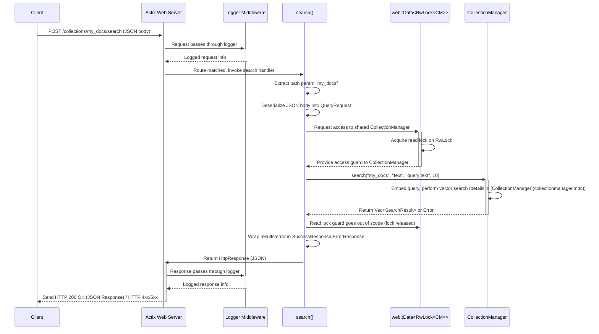
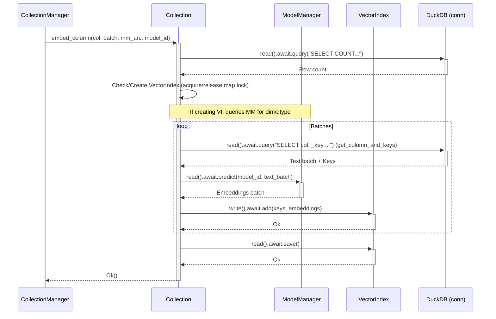
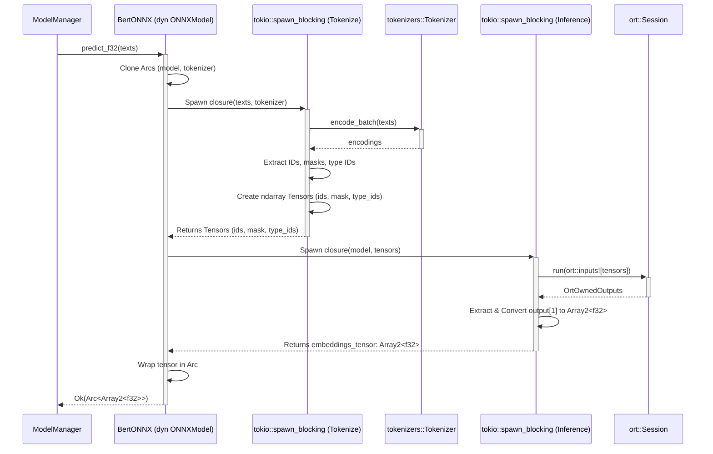
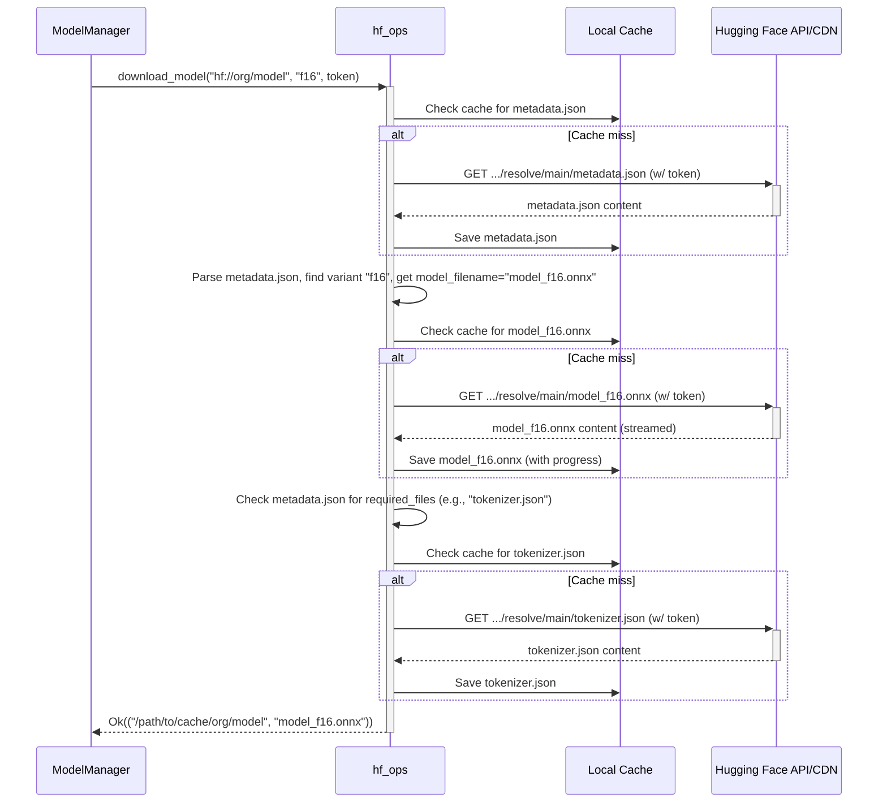

`letsearch` is a Rust application designed for efficient **vector similarity search** on textual datasets. It provides a complete pipeline from data ingestion to search deployment.
The core architecture revolves around the concept of a `Collection` (#0), representing a dataset stored in *DuckDB* and its associated vector indices (*usearch* via `VectorIndex` #4).
Multiple collections are managed by a `CollectionManager` (#1), which acts as a **Facade**, simplifying interactions like data import (JSONL, Parquet) and index creation.
Embedding generation is handled by a `ModelManager` (#2), which abstracts over different model backends (currently *ONNX Runtime* via `ONNXModel` #3) and interacts with `hf_ops` (#5) to download models from the Hugging Face Hub. The `ModelManager` potentially employs a **Flyweight** pattern to manage loaded model instances.
The system exposes functionality through two primary interfaces: a command-line interface (`Cli` #7) built with *clap* for indexing and administrative tasks, and a web server (`Serve` #6) built with *Actix Web* for providing a REST API to search indexed collections.
Concurrency is managed using *Tokio* and standard library synchronization primitives like `Arc<RwLock<T>>` for thread-safe access to shared resources like collections, models, and managers. The design emphasizes modularity, allowing different components (data storage, vector index, model backend) to be potentially swapped or extended.


**Source Repository:** [https://github.com/altaidevorg/letsearch.git](https://github.com/altaidevorg/letsearch.git)



# Chapter 1: Cli / Commands

Welcome to the `letsearch` tutorial! This first chapter focuses on the Command-Line Interface (CLI), which serves as the primary entry point for users interacting with the application.

## Motivation

A robust CLI is essential for any command-line application. It provides a structured way for users to specify the desired operation (like indexing data or starting a search server) and provide necessary parameters (like file paths, model names, or server ports). `letsearch` uses the popular `clap` crate in Rust to define and parse these commands and arguments efficiently and reliably, offering features like automatic help message generation, argument validation, and default values.

## Core Concepts: `clap` Integration

The CLI definition resides primarily in `src/main.rs`. The core components are:

1.  **`Cli` Struct:** The top-level structure representing the entire `letsearch` application command. It uses `clap::Parser` to enable automatic argument parsing.
2.  **`Commands` Enum:** Defines the available subcommands (`Index`, `Serve`, `ListModels`). Each variant holds the specific arguments and options required for that operation.
3.  **`clap` Attributes:** Special attributes (`#[derive(Parser)]`, `#[command(...)]`, `#[arg(...)]`, `#[derive(Subcommand)]`) are used to declaratively define the CLI structure, arguments, options, help messages, default values, and validation rules.

**Use Case:** Indexing Documents

A central use case is indexing documents into a collection. A user might invoke `letsearch` like this:

```bash
letsearch index --files "data/*.jsonl" --collection-name "my_docs" --model "hf://sentence-transformers/all-MiniLM-L6-v2" --index-columns "text" --overwrite
```

This command instructs `letsearch` to:
*   Execute the `Index` subcommand.
*   Process all `.jsonl` files in the `data/` directory.
*   Create or overwrite a collection named `my_docs`.
*   Use the specified Hugging Face model for embedding.
*   Index the content of the `text` column.
*   Overwrite the collection if it already exists.

## Defining the CLI Structure

Let's examine how `clap` is used to define this structure.

**1. The Main Application (`Cli` struct):**

```rust
// src/main.rs
use clap::{Parser, Subcommand};

/// CLI application for indexing and searching documents
#[derive(Parser, Debug)]
#[command(
    name = "letsearch",
    version = "0.1.14", // Example version
    author = "yusufsarigoz@gmail.com",
    about = "Single binary to embed, index, serve and search your documents",
    subcommand_required = true, // A subcommand must be provided
    arg_required_else_help = true // Show help if no args/subcommand given
)]
pub struct Cli {
    #[command(subcommand)] // Indicates this field holds the chosen subcommand
    command: Commands,
}
```

*   `#[derive(Parser)]`: Enables `clap`'s parsing capabilities for this struct.
*   `#[command(...)]`: Provides metadata for the main command (name, version, author, description).
*   `subcommand_required = true`: Ensures the user must specify one of the defined subcommands (`index`, `serve`, or `list-models`).
*   `arg_required_else_help = true`: If the user runs `letsearch` without any arguments, the help message is displayed instead of an error.
*   `command: Commands`: This field will hold an instance of the `Commands` enum corresponding to the subcommand chosen by the user.

**2. Defining Subcommands (`Commands` enum):**

```rust
// src/main.rs
#[derive(Subcommand, Debug)]
pub enum Commands {
    /// Index documents
    Index { /* ... arguments ... */ },

    /// serve a collection for search over web API
    Serve { /* ... arguments ... */ },

    /// list models compatible with letsearch
    ListModels { /* ... arguments ... */ },
}
```

*   `#[derive(Subcommand)]`: Marks this enum as representing the available subcommands.
*   Each variant (`Index`, `Serve`, `ListModels`) corresponds to a subcommand users can type (e.g., `letsearch index ...`).
*   The doc comments (`/// ...`) automatically become the help descriptions for each subcommand.

**3. Defining Arguments and Options (Inside `Commands` variants):**

Let's look at the `Index` subcommand's arguments:

```rust
// src/main.rs (Inside Commands::Index)
#[derive(Subcommand, Debug)]
pub enum Commands {
    /// Index documents
    Index {
        /// Path to file(s) to index.
        /// You can provide local or hf://datasets paths.
        /// It might be a regular path or a glob pattern.
        #[arg(required = true)] // This argument is mandatory
        files: String,

        /// name of the collection to be created
        #[arg(short, long, required = true)] // -c or --collection-name, mandatory
        collection_name: String,

        /// Model to create embeddings.
        #[arg(short, long, default_value = "hf://mys/minilm")] // -m or --model, has default
        model: String,

        // ... other args like variant, hf_token, batch_size ...

        /// columns to embed and index for vector search.
        #[arg(short, long, action = clap::ArgAction::Append)] // -i or --index-columns, repeatable
        index_columns: Vec<String>,

        /// remove and re-create collection if it exists
        #[arg(long, action=clap::ArgAction::SetTrue)] // --overwrite, a boolean flag
        overwrite: bool,
    },
    // ... Serve, ListModels ...
}
```

*   `#[arg(...)]`: Used to configure each field as a command-line argument or option.
*   `required = true`: Makes the argument mandatory.
*   `short`: Defines a short flag (e.g., `-c`).
*   `long`: Defines a long flag (e.g., `--collection-name`).
*   `default_value = "..."`: Provides a default value if the user doesn't specify the option.
*   `action = clap::ArgAction::Append`: Allows the option to be specified multiple times (e.g., `-i col1 -i col2`), collecting values into a `Vec`.
*   `action = clap::ArgAction::SetTrue`: Defines a boolean flag (present means `true`, absent means `false`).
*   Doc comments on fields provide help text for individual arguments/options.

## Parsing and Execution Flow

The `main` function orchestrates the parsing and dispatching of commands.

**1. Parsing:**

```rust
// src/main.rs
#[tokio::main]
async fn main() -> anyhow::Result<()> {
    // ... logger setup ...

    let cli = Cli::parse(); // <--- Parsing happens here

    // ... rest of the function ...
    Ok(())
}
```

*   `Cli::parse()`: This is the core `clap` function call. It reads the command-line arguments provided by the user, validates them against the `Cli` struct and `Commands` enum definitions, and populates an instance of `Cli` with the parsed values. If validation fails (e.g., missing required argument), `clap` automatically prints an error message and exits.

**2. Dispatching:**

After successful parsing, the `main` function uses a `match` statement to determine which subcommand was executed and extracts its arguments.

```rust
// src/main.rs
match &cli.command {
    Commands::Index {
        files,
        collection_name,
        model,
        variant,
        hf_token,
        batch_size,
        index_columns,
        overwrite,
    } => {
        // --- Logic for the Index command ---
        info!("Handling 'index' command...");
        // 1. Create CollectionConfig
        let mut config = CollectionConfig::default();
        // ... populate config from parsed args ...

        // 2. Handle HF Token (CLI arg or environment variable)
        let token = hf_token.clone().or_else(|| std::env::var("HF_TOKEN").ok());

        // 3. Instantiate CollectionManager
        let collection_manager = CollectionManager::new(token); // See [CollectionManager](collectionmanager.mdc)

        // 4. Call CollectionManager methods
        collection_manager.create_collection(config, *overwrite).await?;
        // ... import data (JSONL/Parquet) ...
        // ... embed columns ...
        info!("Indexing complete for collection '{}'", collection_name);
    }

    Commands::Serve {
        collection_name,
        host,
        port,
        hf_token,
    } => {
        // --- Logic for the Serve command ---
        info!("Handling 'serve' command...");
        let token = hf_token.clone().or_else(|| std::env::var("HF_TOKEN").ok());
        // Call the server function
        run_server(host.clone(), *port, collection_name.clone(), token).await?; // See [Serve (Actix Web App)](serve__actix_web_app_.mdc)
    }

    Commands::ListModels { hf_token } => {
        // --- Logic for the ListModels command ---
        info!("Handling 'list-models' command...");
        let token = hf_token.clone().or_else(|| std::env::var("HF_TOKEN").ok());
        // Call the Hugging Face operations function
        list_models(token).await?; // See [hf_ops](hf_ops.mdc)
    }
}
```

*   The `match` statement branches based on the `command` field of the parsed `cli` struct.
*   Inside each branch, the specific arguments defined for that subcommand variant are destructured (e.g., `files`, `collection_name`, etc.).
*   These extracted values are then used to configure and call the appropriate application logic:
    *   `Index`: Interacts heavily with the [CollectionManager](collectionmanager.mdc) to create collections, import data, and trigger embedding/indexing.
    *   `Serve`: Calls `run_server` (defined in `src/serve.rs`) to start the Actix Web server, covered in the [Serve (Actix Web App)](serve__actix_web_app_.mdc) chapter.
    *   `ListModels`: Calls `list_models` from the [hf_ops](hf_ops.mdc) module to interact with the Hugging Face Hub.
*   Notice the pattern for handling the optional `hf_token`: it prioritizes the command-line argument (`--hf-token`) and falls back to the `HF_TOKEN` environment variable if the argument is not provided.

## Internal Flow Diagram

Here's a simplified sequence diagram illustrating the flow when a user runs the `index` command:



## Conclusion

This chapter detailed how `letsearch` uses the `clap` crate to define a structured and user-friendly command-line interface. You learned about the `Cli` struct, the `Commands` enum, and how `clap` attributes are used to define subcommands, arguments, options, and help messages. We also saw how the `main` function parses these arguments using `Cli::parse()` and dispatches control to the relevant application logic based on the chosen subcommand. This CLI layer acts as the crucial entry point, translating user intent into actions within the `letsearch` application.

The next chapter, [Serve (Actix Web App)](serve__actix_web_app_.mdc), will dive into the implementation of the `Serve` command, exploring how the Actix Web framework is used to expose search functionality over an HTTP API.

# Chapter 2: Serve (Actix Web App)

Following our exploration of the command-line interface in [Chapter 1: Cli / Commands](cli___commands.mdc), which allows users to index data and initiate the server, this chapter delves into the `serve` functionality itself. We'll examine how `letsearch` utilizes the Actix Web framework to create an asynchronous HTTP server, exposing a RESTful API for interacting with the indexed document collections.

## Motivation

While the CLI is suitable for one-off indexing tasks, accessing search capabilities often requires a persistent service that other applications or users can interact with over a network. A web server provides this interface. `letsearch` employs Actix Web, a powerful and high-performance web framework for Rust, to build this server component. It allows defining routes, handling HTTP requests efficiently, managing shared application state (like access to our document collections), and returning structured responses (JSON). This enables `letsearch` to function as a dedicated vector search microservice.

## Central Use Case: Performing a Vector Search

Imagine a user wants to find documents in the "my_docs" collection whose "text" content is semantically similar to the query "information retrieval techniques". Using a tool like `curl`, they would send an HTTP POST request to the running `letsearch` server:

```bash
curl -X POST http://127.0.0.1:7898/collections/my_docs/search \
     -H "Content-Type: application/json" \
     -d '{
           "column_name": "text",
           "query": "information retrieval techniques",
           "limit": 5
         }'
```

The server would then:
1. Receive the request targeting the `search` endpoint for the `my_docs` collection.
2. Parse the JSON payload containing the column to search (`text`), the query string, and the desired number of results (`limit`).
3. Use the query string to generate a vector embedding.
4. Perform a similarity search within the "text" column's index for the "my_docs" collection.
5. Return the top 5 most similar documents as a JSON response.

## Core Concepts

Let's break down the key components involved in building the Actix Web server in `src/serve.rs`.

1.  **Actix Web Framework:** The foundation. It provides the `HttpServer`, `App` structure, routing macros, request/response types, and middleware capabilities needed to build the web application. It operates asynchronously, making it efficient for I/O-bound tasks like network communication.

2.  **Routing:** Defines how incoming HTTP requests (method + path) are mapped to specific Rust functions (handlers). `letsearch` uses `App::route()` with methods like `web::get()` and `web::post()`.
    ```rust
    // Example route definition within App::new() closure
    .route("/", web::get().to(healthcheck)) // GET / maps to healthcheck function
    .route(
        "/collections/{collection_name}/search",
        web::post().to(search), // POST /collections/{name}/search maps to search function
    )
    ```
    Path parameters like `{collection_name}` are automatically extracted.

3.  **Shared State (`web::Data` and `RwLock`):** The web server needs access to the loaded collection data. Since multiple requests might need this data concurrently, it's wrapped in shared state management structures.
    *   `CollectionManager`: The central orchestrator for loading and interacting with collections (covered in detail in [CollectionManager](collectionmanager.mdc)).
    *   `tokio::sync::RwLock`: Allows multiple concurrent reads *or* one exclusive write to the `CollectionManager`. This is crucial for allowing simultaneous search requests (reads) while ensuring safety if the manager needed mutation (though mutation isn't typical during serving).
    *   `actix_web::web::Data`: An Actix helper type used to wrap shared application state (`RwLock<CollectionManager>`) and make it accessible within handlers.

    ```rust
    // In run_server function
    let collection_manager = CollectionManager::new(token);
    // ... load collection ...
    let shared_manager = web::Data::new(RwLock::new(collection_manager)); // Wrap manager

    // In HttpServer::new closure
    App::new()
        .app_data(shared_manager.clone()) // Register shared state with the App
        // ... routes ...
    ```

4.  **Request Handling & Extraction:** Handler functions receive request details as arguments. Actix provides "extractors" to easily access parts of the request:
    *   `web::Path<T>`: Extracts path parameters (e.g., `web::Path<String>` for `collection_name`).
    *   `web::Json<T>`: Deserializes the request body as JSON into a specified struct (e.g., `web::Json<QueryRequest>`).
    *   `web::Data<T>`: Accesses the shared application state.

    ```rust
    // search handler signature
    async fn search(
        collection_name: web::Path<String>, // Extracts {collection_name}
        req: web::Json<QueryRequest>,       // Extracts JSON body
        manager: web::Data<RwLock<CollectionManager>>, // Accesses shared state
    ) -> impl Responder {
        // ... handler logic ...
    }
    ```

5.  **Response Serialization (`SuccessResponse`, `ErrorResponse`):** To provide consistent API responses, `letsearch` uses standard wrapper structs:
    *   `SuccessResponse<T>`: Wraps successful results (`data: T`), includes status ("ok"), and processing time.
    *   `ErrorResponse`: Used for errors, includes status ("error"), an error message, and processing time.
    Both implement `serde::Serialize` to be easily converted to JSON. Handler functions return types implementing `impl Responder`, commonly `HttpResponse::Ok().json(...)` or `HttpResponse::NotFound().json(...)`.

    ```rust
    #[derive(Serialize)]
    struct SuccessResponse<T: Serialize> {
        data: T,
        status: String,
        time: f64,
    }
    // ... ErrorResponse similar ...

    // Example usage in a handler
    let results = manager.read().await.search(/*...*/).await;
    match results {
        Ok(data) => HttpResponse::Ok().json(SuccessResponse::new(
            SearchResultsResponse { results: data }, // Actual payload
            start, // For timing
        )),
        Err(e) => HttpResponse::NotFound().json(ErrorResponse::new(e.to_string(), start)),
    }
    ```

6.  **Middleware (`Logger`):** Actix middleware intercepts requests/responses to perform cross-cutting actions. `letsearch` uses `actix_web::middleware::Logger` to automatically log incoming requests and their outcomes.

    ```rust
    // In HttpServer::new closure
    App::new()
        .wrap(Logger::new("from %a to %r with %s in %T secs")) // Add logging
        // ... app_data, routes ...
    ```

## API Endpoints

The `run_server` function initializes and starts the Actix web server, configuring the following routes:

1.  **`GET /` - Health Check:**
    *   Handler: `healthcheck()`
    *   Purpose: Simple endpoint to verify the server is running.
    *   Response: JSON object with server version and status "ok".
    ```rust
    async fn healthcheck() -> impl Responder {
        let start = Instant::now();
        let response = SuccessResponse::new(
            HelthcheckResponse { /* ... version, status ... */ },
            start,
        );
        HttpResponse::Ok().json(response)
    }
    ```

2.  **`GET /collections` - List Collections:**
    *   Handler: `get_collections(manager: web::Data<RwLock<CollectionManager>>)`
    *   Purpose: Retrieve a list of currently loaded collections and their configurations (name, indexed columns).
    *   Interaction: Acquires a read lock on the `CollectionManager` and calls its `get_collection_configs()` method.
    *   Response: JSON array of collection configurations wrapped in `SuccessResponse`.
    ```rust
    async fn get_collections(manager: web::Data<RwLock<CollectionManager>>) -> impl Responder {
        let start = Instant::now();
        let manager_guard = manager.read().await; // Acquire read lock
        let configs = manager_guard.get_collection_configs().await;
        // ... map configs to presentable format ...
        let response = SuccessResponse::new(
            CollectionsResponse { collections: /* ... */ },
            start,
        );
        HttpResponse::Ok().json(response)
    } // Read lock released when manager_guard goes out of scope
    ```

3.  **`GET /collections/{collection_name}` - Get Collection Details:**
    *   Handler: `get_collection(collection_name: web::Path<String>, manager: web::Data<RwLock<CollectionManager>>)`
    *   Purpose: Get configuration details for a specific collection identified by `collection_name` in the path.
    *   Interaction: Acquires read lock, calls `CollectionManager::get_collection_config(name)`.
    *   Response: JSON object of the specific collection's config (wrapped in `SuccessResponse`) or a 404 `ErrorResponse` if not found.

4.  **`POST /collections/{collection_name}/search` - Perform Search:**
    *   Handler: `search(collection_name: web::Path<String>, req: web::Json<QueryRequest>, manager: web::Data<RwLock<CollectionManager>>)`
    *   Purpose: Execute a vector similarity search within a specified collection and column.
    *   Request Body (`QueryRequest`): Requires `column_name` (string), `query` (string), and optional `limit` (u32, default 10, max 100).
    ```rust
    #[derive(Deserialize)]
    struct QueryRequest {
        column_name: String,
        query: String,
        limit: Option<u32>,
    }
    ```
    *   Interaction: Acquires read lock, calls `CollectionManager::search(name, column, query, limit)`. This involves embedding the query and querying the [VectorIndex](vectorindex.mdc).
    *   Response: JSON array of `SearchResult` objects (containing document content and similarity score) wrapped in `SuccessResponse`, or an `ErrorResponse` (e.g., 404 if collection/column not found, 400 for invalid input).
    ```rust
    // Simplified search handler logic
    async fn search(/*... args ...*/) -> impl Responder {
        let start = Instant::now();
        let name = collection_name.into_inner();
        let limit = req.limit.unwrap_or(10);
        // ... input validation (e.g., limit range) ...

        let manager_guard = manager.read().await; // Acquire read lock
        let results = manager_guard
            .search(name, req.column_name.clone(), req.query.clone(), limit)
            .await; // Delegate to CollectionManager

        match results {
            Ok(search_results) => HttpResponse::Ok().json(SuccessResponse::new(
                SearchResultsResponse { results: search_results }, start)),
            Err(e) => HttpResponse::NotFound().json(ErrorResponse::new(e.to_string(), start)),
        }
    } // Read lock released
    ```

## Internal Implementation

Let's trace the flow of a `POST /collections/my_docs/search` request:



**Code Structure (`src/serve.rs`):**

1.  **Response Structs:** `ErrorResponse`, `SuccessResponse`, and specific payload structs (`HelthcheckResponse`, `CollectionsResponse`, etc.) are defined with `#[derive(Serialize)]`. `QueryRequest` uses `#[derive(Deserialize)]`.
2.  **Handler Functions:** `healthcheck`, `get_collections`, `get_collection`, `search`. Each is an `async fn` returning `impl Responder`. They contain logic for timing, request extraction, interaction with `CollectionManager` via `web::Data`, and response construction.
3.  **`run_server` Function:**
    *   The entry point called by `main.rs` when the `serve` command is used.
    *   Creates a `CollectionManager`.
    *   Loads the specified initial collection using `collection_manager.load_collection()`.
    *   Wraps the manager in `web::Data::new(RwLock::new(...))`.
    *   Creates the `HttpServer` instance.
    *   Inside `HttpServer::new`, an `App` is configured:
        *   Shared state is attached via `.app_data()`.
        *   Middleware (`Logger`) is added via `.wrap()`.
        *   Routes are defined using `.route()` mapping paths/methods to handlers.
    *   Binds the server to the specified host and port using `.bind()`.
    *   Starts the server event loop using `.run().await`.

```rust
// src/serve.rs (Simplified run_server)
pub async fn run_server(
    host: String,
    port: i32,
    collection_name: String,
    token: Option<String>,
) -> std::io::Result<()> {
    let collection_manager = CollectionManager::new(token); // Create manager
    // Load initial collection (Error handling omitted for brevity)
    let _ = collection_manager.load_collection(collection_name).await.unwrap();

    // Wrap in thread-safe, shareable structures
    let shared_manager = web::Data::new(RwLock::new(collection_manager));

    log::info!("Starting server at http://{}:{}", host, port);

    HttpServer::new(move || { // Factory closure for each worker thread
        App::new()
            .app_data(shared_manager.clone()) // Share manager access
            .wrap(Logger::default())        // Add request logging
            // Define API routes
            .route("/", web::get().to(healthcheck))
            .route("/collections", web::get().to(get_collections))
            .route("/collections/{collection_name}", web::get().to(get_collection))
            .route("/collections/{collection_name}/search", web::post().to(search))
    })
    .bind(format!("{host}:{port}"))? // Bind to address
    .run()                           // Start the server
    .await
}
```

## Conclusion

This chapter detailed how `letsearch` implements its web server component using Actix Web. We covered the core concepts: routing, shared state management with `web::Data` and `RwLock`, request handling, standardized JSON responses, and middleware. You learned about the specific API endpoints exposed for health checks, collection listing/details, and crucially, performing vector similarity searches via `POST` requests. This server component transforms `letsearch` from a CLI tool into an accessible network service.

The next chapter, [CollectionManager](collectionmanager.mdc), will explore the abstraction responsible for managing the lifecycle and operations of the collections served by this API.

# Chapter 3: CollectionManager

In [Chapter 2: Serve (Actix Web App)](serve__actix_web_app_.mdc), we saw how `letsearch` exposes its functionality via a REST API. Handlers in that web server need a way to interact with the underlying data collections. This chapter introduces the `CollectionManager`, the central component responsible for managing the lifecycle and operations of multiple `Collection` instances within `letsearch`.

## Motivation

Managing individual collections directly can become complex, especially when dealing with multiple collections simultaneously or coordinating dependencies like embedding models. The `CollectionManager` addresses this by implementing the **Facade pattern**. It provides a simplified, high-level interface to a more complex subsystem (the individual collections and the model loading mechanism). This simplifies the code in the CLI ([Chapter 1: Cli / Commands](cli___commands.mdc)) and the web server handlers, making it easier to:

*   Create new collections with specific configurations.
*   Load existing collections from disk.
*   Access specific collections by name for operations.
*   Ensure necessary embedding models are loaded via the [ModelManager](modelmanager.mdc) when a collection is created or loaded.
*   Route operations like data import, embedding, and search to the correct underlying `Collection` instance.
*   Manage concurrent access safely using locks.

## Central Use Case: Indexing Workflow via Manager

Consider the `letsearch index` command discussed in Chapter 1. The user provides a collection name, data files, model details, and columns to index. The `main.rs` logic doesn't interact directly with a `Collection` object; instead, it uses the `CollectionManager` to orchestrate the entire process:

```rust
// Simplified from src/main.rs
async fn handle_index_command(
    // ... args like files, collection_name, model, index_columns, overwrite ...
    hf_token: Option<String>
) -> anyhow::Result<()> {
    // 1. Instantiate the Manager
    let collection_manager = CollectionManager::new(hf_token);

    // 2. Define Collection Configuration
    let mut config = CollectionConfig::default();
    config.name = collection_name.to_string();
    config.model_name = model.to_string();
    // ... set other config fields ...
    config.index_columns = index_columns.to_vec();

    // 3. Create (or overwrite) the Collection via the Manager
    // This also triggers loading the required embedding model.
    collection_manager.create_collection(config, overwrite).await?;
    info!("Collection '{}' created/ready", collection_name);

    // 4. Import Data via the Manager
    if files.ends_with(".jsonl") {
        collection_manager.import_jsonl(&collection_name, files).await?;
    } else if files.ends_with(".parquet") {
        collection_manager.import_parquet(&collection_name, files).await?;
    }
    info!("Data imported into '{}'", collection_name);

    // 5. Embed specified columns via the Manager
    for column_name in &index_columns {
        collection_manager.embed_column(&collection_name, column_name, batch_size).await?;
        info!("Column '{}' embedded and indexed", column_name);
    }

    info!("Indexing complete for collection '{}'", collection_name);
    Ok(())
}
```

This example demonstrates how the `CollectionManager` acts as the single point of interaction for the CLI, hiding the complexity of collection instantiation, model loading, data handling, and embedding.

## Core Concepts

1.  **Facade Pattern:** The `CollectionManager` provides a unified and simplified interface (`create_collection`, `load_collection`, `import_jsonl`, `embed_column`, `search`, etc.) over the potentially complex interactions between `Collection` instances, the `ModelManager`, and file system operations.

2.  **Collection Registry:** At its heart, the manager holds a map of all currently loaded collections. This map is designed for thread safety:
    *   `HashMap<String, Arc<RwLock<Collection>>>`: Maps collection names (String) to `Collection` instances.
    *   `Arc`: (Atomic Reference Counting) Allows multiple parts of the application (e.g., different web server requests) to share ownership of the same `Collection` instance without needing to clone the entire collection data.
    *   `tokio::sync::RwLock`: Provides asynchronous read-write locking. Multiple tasks can read the `Collection` state concurrently (e.g., multiple simultaneous search requests), but writing (e.g., importing data, embedding) requires exclusive access, preventing data races. The outer `RwLock` on the `HashMap` itself protects the map structure during additions or removals of collections.

    ```rust
    // src/collection/collection_manager.rs
    pub struct CollectionManager {
        collections: RwLock<HashMap<String, Arc<RwLock<Collection>>>>,
        // ... other fields ...
    }
    ```
    *Explanation:* This structure ensures that the registry of collections can be safely accessed and modified from concurrent async tasks, which is essential for the web server.

3.  **Model Coordination:** Collections require specific embedding models. When `create_collection` or `load_collection` is called, the `CollectionManager`:
    *   Inspects the `CollectionConfig` (for new collections) or the loaded `Collection`'s state to determine the required model (name and variant).
    *   Checks its internal `model_lookup: RwLock<HashMap<(String, String), u32>>` to see if this model (identified by name and variant tuple) has already been loaded by the [ModelManager](modelmanager.mdc).
    *   If the model isn't loaded, it instructs the `ModelManager` (via `model_manager.load_model(...)`) to load it.
    *   Stores the `model_id` returned by `ModelManager` in its `model_lookup` map for future use (e.g., during `embed_column` or `search`). This avoids redundant loading and provides efficient access.

    ```rust
    // Simplified logic within create_collection/load_collection
    async fn ensure_model_loaded(&self, collection: &Arc<RwLock<Collection>>) -> anyhow::Result<()> {
        let requested_models = collection.read().await.requested_models().await; // [(name, variant)]
        if !requested_models.is_empty() {
            let manager_guard = self.model_manager.write().await; // Lock ModelManager
            let mut lookup_guard = self.model_lookup.write().await; // Lock local lookup
            for model_key in requested_models {
                if !lookup_guard.contains_key(&model_key) {
                    let (model_path, model_variant) = model_key.clone();
                    // Ask ModelManager to load
                    let model_id = manager_guard.load_model(
                        model_path, model_variant, Backend::ONNX, self.token.clone()
                    ).await?;
                    // Store the ID locally
                    lookup_guard.insert(model_key, model_id);
                }
            }
        }
        Ok(())
    }
    ```
    *Explanation:* This coordination ensures that models are loaded on demand when a collection requiring them is initialized, linking the collection lifecycle to the model lifecycle.

4.  **Operation Routing:** Methods like `import_jsonl`, `embed_column`, and `search` take a `collection_name` as an argument. The `CollectionManager` performs these steps:
    *   Acquires a read lock on the `collections` map.
    *   Looks up the `Arc<RwLock<Collection>>` associated with the provided `collection_name`.
    *   If found, it clones the `Arc` (cheap operation, increments reference count).
    *   Releases the read lock on the `collections` map.
    *   Acquires the appropriate lock (read for `search`, write for `import_jsonl`/`embed_column`) on the *specific collection's* `RwLock`.
    *   Calls the corresponding method on the underlying `Collection` instance, potentially passing necessary context like the `ModelManager` reference or the `model_id`.
    *   Handles potential errors (e.g., collection not found).

    ```rust
    // Simplified src/collection/collection_manager.rs - search method
    pub async fn search(
        &self,
        collection_name: String,
        column_name: String,
        query: String,
        limit: u32,
    ) -> anyhow::Result<Vec<SearchResult>> {
        // 1. Look up Collection Arc
        let collection_arc = { // Scope for collections read lock
            let collections_guard = self.collections.read().await;
            collections_guard.get(collection_name.as_str()).cloned()
                .ok_or_else(|| anyhow::anyhow!("Collection '{}' not found", collection_name))?
        }; // collections read lock released here

        // 2. Look up Model ID
        let model_id = { // Scope for model_lookup read lock
            let config = collection_arc.read().await.config();
            let model_key = (config.model_name, config.model_variant);
            self.model_lookup.read().await.get(&model_key).copied()
                .ok_or_else(|| anyhow::anyhow!("Model '{:?}' not loaded", model_key))?
        }; // model_lookup read lock released here

        // 3. Acquire read lock on the specific Collection and delegate
        let results = collection_arc.read().await.search(
            column_name,
            query,
            limit,
            self.model_manager.clone(), // Pass Arc<RwLock<ModelManager>>
            model_id,
        ).await?;

        Ok(results)
    }
    ```
    *Explanation:* This demonstrates the routing mechanism: find the target collection, gather necessary context (like `model_id`), acquire the correct lock on the target, and delegate the actual work.

## Internal Implementation

Let's trace the flow when `create_collection` is called, as seen in the central use case.

**High-Level Flow (`create_collection`):**

1.  **Input:** `CollectionConfig` (containing name, model info, etc.), `overwrite` flag.
2.  **Action:**
    a.  Instantiate a new `Collection` using `Collection::new(config, overwrite)`. This might involve creating directories on disk.
    b.  Wrap the new `Collection` in `Arc::new(RwLock::new(...))`.
    c.  Call the internal `ensure_model_loaded` helper (described above) to:
        i.  Read the required models from the new collection's config.
        ii. Acquire write locks on `model_manager` and `model_lookup`.
        iii. For each required model, if not already in `model_lookup`:
            *   Call `model_manager.load_model(...)`.
            *   Store the returned `model_id` in `model_lookup`.
        iv. Release locks.
    d.  Acquire a write lock on the main `collections` HashMap.
    e.  Insert the new `Arc<RwLock<Collection>>` into the map with the collection name as the key.
    f.  Release the write lock on the `collections` map.
3.  **Output:** `Ok(())` if successful, or an `Err` if collection creation, model loading, or locking fails.

**Sequence Diagram (`create_collection`):**

```mermaid
sequenceDiagram
    participant Client as CLI/User
    participant CM as CollectionManager
    participant CollectionType as Collection::new()
    participant MM as ModelManager
    participant ML as model_lookup (HashMap)
    participant CollectionsMap as collections (HashMap)

    Client->>+CM: create_collection(config, overwrite)
    CM->>+CollectionType: new(config, overwrite)
    CollectionType-->>-CM: Returns Ok(collection) or Err
    CM->>CM: Wrap collection in Arc<RwLock<Collection>>
    CM->>+CM: ensure_model_loaded(collection_arc)
    CM->>collection_arc: read().await.requested_models()
    collection_arc-->>CM: Returns [(model_name, variant)]
    CM->>+MM: write().await (acquire lock)
    CM->>+ML: write().await (acquire lock)
    alt Model not in ML
        CM->>MM: load_model(name, variant, ONNX, token)
        MM-->>CM: Returns Ok(model_id) or Err
        CM->>ML: insert((name, variant), model_id)
    end
    CM->>-ML: Release lock
    CM->>-MM: Release lock
    CM-->>-CM: Model loading complete
    CM->>+CollectionsMap: write().await (acquire lock)
    CM->>CollectionsMap: insert(config.name, collection_arc)
    CM->>-CollectionsMap: Release lock
    CM-->>-Client: Returns Ok(()) or Err
```

**Code Snippets (`src/collection/collection_manager.rs`):**

*   **Structure Definition:**
    ```rust
    use crate::collection::collection_type::Collection;
    use crate::model::model_manager::ModelManager;
    use crate::model::model_utils::Backend;
    use std::collections::HashMap;
    use std::sync::Arc;
    use tokio::sync::RwLock;
    use super::collection_utils::{CollectionConfig, SearchResult};

    pub struct CollectionManager {
        // Registry of loaded collections
        collections: RwLock<HashMap<String, Arc<RwLock<Collection>>>>,
        // Shared access to the model manager
        model_manager: Arc<RwLock<ModelManager>>,
        // Cache for loaded model IDs (Model Name, Variant) -> Model ID
        model_lookup: RwLock<HashMap<(String, String), u32>>,
        // Optional Hugging Face token
        token: Option<String>,
    }
    ```
    *Explanation:* Defines the core fields holding the state: the collection registry, the model manager instance, the model lookup cache, and the HF token.

*   **Constructor:**
    ```rust
    impl CollectionManager {
        pub fn new(token: Option<String>) -> Self {
            CollectionManager {
                collections: RwLock::new(HashMap::new()),
                model_manager: Arc::new(RwLock::new(ModelManager::new())),
                model_lookup: RwLock::new(HashMap::new()),
                token: token,
            }
        }
    // ... other methods ...
    }
    ```
    *Explanation:* Initializes the manager with empty maps and a new `ModelManager` instance, wrapped appropriately for shared access.

*   **`create_collection` (Simplified):**
    ```rust
    pub async fn create_collection(
        &self,
        config: CollectionConfig,
        overwrite: bool,
    ) -> anyhow::Result<()> {
        let name = config.name.clone();
        // 1. Create the underlying Collection instance
        let collection_arc = Arc::new(RwLock::new(Collection::new(config, overwrite).await?));

        // 2. Ensure associated model is loaded
        self.ensure_model_loaded(&collection_arc).await?; // Simplified helper

        // 3. Add to the registry
        let mut collections_map_guard = self.collections.write().await;
        collections_map_guard.insert(name.clone(), collection_arc.clone());

        Ok(())
    }

    // Internal helper (conceptual)
    async fn ensure_model_loaded(&self, collection_arc: &Arc<RwLock<Collection>>) -> anyhow::Result<()> {
        // ... logic as described in Core Concepts/Model Coordination ...
        // ... involves locking model_manager and model_lookup ...
        // ... calls model_manager.load_model(...) if needed ...
        Ok(())
    }
    ```
    *Explanation:* Shows the primary steps: create `Collection`, ensure model via helper, insert into the locked map.

*   **`import_jsonl` (Simplified):**
    ```rust
    pub async fn import_jsonl(
        &self,
        collection_name: &str,
        jsonl_path: &str,
    ) -> anyhow::Result<()> {
        // 1. Find the collection Arc (read lock on map)
        let collection_arc = {
            let collections_guard = self.collections.read().await;
            collections_guard.get(collection_name).cloned()
                .ok_or_else(|| /* ... error ... */)?
        }; // map read lock released

        // 2. Delegate to the collection (write lock on collection)
        let collection_guard = collection_arc.write().await;
        collection_guard.import_jsonl(jsonl_path).await
    }
    ```
    *Explanation:* Highlights the pattern: look up the `Arc`, release the map lock, acquire a write lock on the specific collection, and delegate.

## Conclusion

The `CollectionManager` serves as a crucial abstraction layer in `letsearch`. By acting as a Facade, it simplifies interactions with collections for both the CLI and the web server. It manages a thread-safe registry of `Collection` instances, coordinates the loading of required embedding models via the `ModelManager`, and routes operations like data import and search to the appropriate collection. This centralized management makes the overall system more robust and easier to extend.

In the next chapter, [Chapter 4: Collection](collection.mdc), we will dive into the `Collection` struct itself, exploring how individual collections store their data, manage their vector indices, and perform the operations delegated by the `CollectionManager`.

# Chapter 4: Collection

In the previous chapter, [Chapter 3: CollectionManager](collectionmanager.mdc), we explored how `letsearch` manages multiple collections through a unified facade. Now, we delve deeper into the core component managed by the `CollectionManager`: the `Collection` struct itself. This chapter details how a `Collection` instance encapsulates the data, indices, and configuration for a single dataset or corpus.

## Motivation

While the `CollectionManager` provides a high-level interface, the actual work of storing data, managing vector indices, and performing operations like import, embedding, and search happens within a `Collection` instance. This struct serves as the central hub for a specific dataset, encapsulating:

1.  **Primary Data Storage:** Using DuckDB for efficient storage and querying of structured data.
2.  **Vector Indices:** Managing associated [VectorIndex](vectorindex.mdc) instances for similarity search on specific columns.
3.  **Configuration:** Holding the collection-specific settings defined in `CollectionConfig`.
4.  **Operational Logic:** Containing the methods to import data, trigger embedding processes, and retrieve/search data.

This encapsulation ensures that all aspects related to a single dataset are grouped logically, making the system modular and easier to manage.

## Central Use Case: Embedding a Column

Imagine the `CollectionManager` receives a request (perhaps originating from the `letsearch index` command) to embed the `text` column of a collection named `my_docs`. The `CollectionManager` would:

1.  Locate the `Arc<RwLock<Collection>>` for `my_docs`.
2.  Acquire a write lock on that specific `Collection` instance.
3.  Look up the necessary `model_id` for the collection's configured embedding model.
4.  Call the `embed_column` method on the locked `Collection` instance, passing the column name (`"text"`), batch size, a reference to the [ModelManager](modelmanager.mdc), and the `model_id`.

The `Collection` instance would then handle the entire embedding and indexing process for the specified column.

## Core Concepts

1.  **Data Storage (DuckDB):**
    *   Each `Collection` maintains a connection to its own DuckDB database file (e.g., `~/.letsearch/collections/my_docs/data.db`).
    *   The connection is wrapped in `Arc<RwLock<Connection>>` to allow safe, concurrent access from asynchronous tasks (multiple reads or one write).
    *   Data is typically loaded into a DuckDB table named after the collection (e.g., `my_docs`). DuckDB's ability to directly query file formats like JSONL and Parquet (`read_json_auto`, `read_parquet`) simplifies the import process.
    *   Schema is often inferred automatically by DuckDB during import.

    ```rust
    // src/collection/collection_type.rs (Simplified Struct)
    use duckdb::Connection;
    use std::sync::Arc;
    use tokio::sync::RwLock;
    // ... other imports ...

    pub struct Collection {
        config: CollectionConfig,
        // Thread-safe access to the DuckDB connection
        conn: Arc<RwLock<Connection>>,
        // Map of column names to their vector indices
        vector_index: RwLock<HashMap<String, Arc<RwLock<VectorIndex>>>>,
    }
    ```
    *Explanation:* The `conn` field holds the shared, lock-protected DuckDB connection essential for all data operations.

2.  **Vector Indices (`VectorIndex`):**
    *   A `Collection` manages a `HashMap` where keys are column names (strings) and values are `Arc<RwLock<VectorIndex>>`. This map itself is protected by a `RwLock` for safe concurrent access.
    *   Each `VectorIndex` (detailed in [Chapter 6: VectorIndex](vectorindex.mdc)) stores the vector embeddings for a *single* column and provides similarity search capabilities for that column.
    *   Indices are typically created on demand when `embed_column` is first called for a specific column. The necessary configuration (vector dimension, metric, data type) is obtained from the associated [ModelManager](modelmanager.mdc) during this process.
    *   Indices are persisted to disk within the collection's directory (e.g., `~/.letsearch/collections/my_docs/index/text.usearch`).

    ```rust
    // src/collection/collection_type.rs (Struct field)
    // ...
    vector_index: RwLock<HashMap<String, Arc<RwLock<VectorIndex>>>>,
    // ...
    ```
    *Explanation:* This field maps indexed column names to their respective thread-safe vector index instances.

3.  **Configuration (`CollectionConfig`):**
    *   Each `Collection` holds an instance of `CollectionConfig` (defined in `src/collection/collection_utils.rs`).
    *   This struct stores metadata like the collection name, the list of columns intended for indexing (`index_columns`), the associated embedding model (`model_name`, `model_variant`), paths to the database (`db_path`) and index directory (`index_dir`) relative to the collection's root.
    *   This configuration is loaded from/saved to `config.json` within the collection's directory.

4.  **Unique Identifier (`_key`):**
    *   To link rows in the DuckDB table with their corresponding vectors in the `VectorIndex`, `letsearch` automatically adds a unique `_key` column (unsigned 64-bit integer) to the DuckDB table during data import if it doesn't already exist.
    *   A DuckDB `SEQUENCE` (`keys_seq`) is used to generate these unique, auto-incrementing keys.
    *   The `VectorIndex` stores vectors associated with these `_key` values. When a similarity search returns keys, they are used to look up the original data in the DuckDB table.

    ```rust
    // src/collection/collection_type.rs - add_keys_to_db (Simplified logic)
    async fn add_keys_to_db(&self, tx: &duckdb::Transaction<'_>) -> anyhow::Result<()> {
        // Check if '_key' column exists using information_schema
        let exists: bool = /* ... SQL query to check existence ... */ ;

        if !exists {
            // Add the sequence and the _key column with a default value
            tx.execute_batch(
                format!(
                    r"CREATE SEQUENCE keys_seq;
    ALTER TABLE {} ADD COLUMN _key UBIGINT DEFAULT NEXTVAL('keys_seq');",
                    self.config.name,
                )
                .as_str(),
            )?;
        }
        Ok(())
    }
    ```
    *Explanation:* This internal helper ensures every row gets a unique `_key` used for linking data and vectors.

## Using `Collection`

Operations on a `Collection` are typically initiated by the [CollectionManager](collectionmanager.mdc).

1.  **Instantiation:**
    *   `Collection::new(config, overwrite)`: Creates a *new* collection. It sets up the directory structure (`~/.letsearch/collections/<name>/`), creates the DuckDB file, saves the `config.json`, and initializes empty structures. If `overwrite` is true and the directory exists, it's removed first.
    *   `Collection::from(name)`: Loads an *existing* collection by reading its `config.json`, opening the DuckDB connection, and loading any persisted `VectorIndex` files found in the index directory.

2.  **Data Import (`import_jsonl`, `import_parquet`):**
    *   These methods take the path to the data file(s).
    *   They acquire a write lock on the `conn` (DuckDB connection).
    *   They execute a DuckDB transaction:
        *   `CREATE TABLE <collection_name> AS SELECT * FROM read_json_auto('<path>')` (or `read_parquet`). This efficiently loads data into the main table.
        *   Call `add_keys_to_db` within the same transaction to ensure the `_key` column is present.
        *   Commit the transaction.

    ```rust
    // src/collection/collection_type.rs (Simplified import_jsonl)
    pub async fn import_jsonl(&self, jsonl_path: &str) -> anyhow::Result<()> {
        let start = Instant::now();
        { // Scope for write lock on connection
            let conn = self.conn.clone();
            let mut conn_guard = conn.write().await;
            let tx = conn_guard.transaction()?; // Start transaction

            // Create table from JSONL file
            tx.execute_batch(
                format!(
                    "CREATE TABLE {} AS SELECT * FROM read_json_auto('{}');",
                    &self.config.name, jsonl_path
                ).as_str(),
            )?;
            // Ensure _key column exists
            self.add_keys_to_db(&tx).await?;

            tx.commit()?; // Commit transaction
        } // Write lock released
        info!("Imported from {} in {:?}", jsonl_path, start.elapsed());
        Ok(())
    }
    ```
    *Explanation:* Demonstrates transactional data loading from a file and the inclusion of the `_key` column.

3.  **Embedding & Indexing (`embed_column`):**
    *   This method is called by the `CollectionManager` after ensuring the required model is loaded.
    *   It receives the `column_name`, `batch_size`, an `Arc<RwLock<ModelManager>>`, and the `model_id`.
    *   **Steps:**
        *   Calculates the total number of rows and batches needed.
        *   Acquires a write lock on the `vector_index` map. If no index exists for `column_name`, it creates a new `VectorIndex`, configuring its dimensions and data type based on the model's output (obtained from `ModelManager`), and adds it to the map (wrapped in `Arc<RwLock<...>>`). Releases the map lock.
        *   Iterates through the data in batches:
            *   Calls `get_column_and_keys` to fetch a batch of text data and corresponding `_key` values from DuckDB.
            *   Calls `model_manager.read().await.predict(...)` to get the embeddings for the text batch.
            *   Acquires a write lock on the *specific* `VectorIndex` for the column.
            *   Calls `vector_index.add(...)` to insert the keys and their embeddings into the index. Releases the index lock.
        *   After processing all batches, acquires a read lock on the specific `VectorIndex` and calls `save()` to persist it to disk.

    ```rust
    // src/collection/collection_type.rs (Simplified get_column_and_keys)
    pub async fn get_column_and_keys(
        &self, column_name: &str, limit: u64, offset: u64
    ) -> anyhow::Result<(Vec<String>, Vec<u64>)> {
        let conn = self.conn.clone();
        let conn_guard = conn.read().await; // Read lock on DB connection

        // Select the text column and the _key column
        let mut stmt = conn_guard.prepare(
            format!(
                "SELECT {}, _key FROM {} LIMIT {} OFFSET {};",
                column_name, &self.config.name, limit, offset
            ).as_str(),
        )?;
        // ... process Arrow RecordBatch to extract Vec<String> and Vec<u64> ...
        Ok((/* values */ Vec::new(), /* keys */ Vec::new())) // Simplified return
    }
    ```
    *Explanation:* Helper method to efficiently retrieve batches of data and their unique keys from DuckDB for processing.

4.  **Search (`search`):**
    *   Receives `column_name`, `query` text, `limit`, `Arc<RwLock<ModelManager>>`, and `model_id`.
    *   **Steps:**
        *   Uses the `ModelManager` to embed the input `query` text.
        *   Acquires a read lock on the `vector_index` map to find the `Arc<RwLock<VectorIndex>>` for the target `column_name`. Releases map lock.
        *   Acquires a read lock on the specific `VectorIndex`.
        *   Calls `vector_index.search(...)` with the query embedding and `limit` to get a list of `SimilarityResult` (containing `key` and `score`). Releases index lock.
        *   Extracts the `_key` values from the search results.
        *   Calls `get_single_column` (similar to `get_column_and_keys` but only fetches the specified column) on DuckDB using the retrieved keys to get the original content associated with the top results.
        *   Combines the original content, keys, and scores into `SearchResult` objects.

    ```rust
    // src/collection/collection_type.rs (Simplified search)
    pub async fn search(
        &self, column_name: String, query: String, limit: u32,
        model_manager: Arc<RwLock<ModelManager>>, model_id: u32,
    ) -> anyhow::Result<Vec<SearchResult>> {
        // 1. Embed query
        let query_embedding = model_manager.read().await.predict(model_id, vec![&query]).await?;

        // 2. Find VectorIndex Arc
        let index_arc = {
            let indices_guard = self.vector_index.read().await;
            indices_guard.get(&column_name).cloned()
                .ok_or_else(|| anyhow::anyhow!("Index not found"))?
        }; // Release map lock

        // 3. Search in VectorIndex
        let similarity_results = {
            let index_guard = index_arc.read().await; // Lock specific index
            index_guard.search(/* query_embedding details */, limit as usize).await?
        }; // Release index lock

        // 4. Get original content from DuckDB using keys from similarity_results
        let keys: Vec<u64> = /* ... extract keys ... */ ;
        let contents = self.get_single_column(&column_name, keys.len() as u64, 0, keys).await?;

        // 5. Combine results
        let search_results = /* ... zip contents, keys, scores ... */;
        Ok(search_results)
    }
    ```
    *Explanation:* Outlines the process of embedding the query, searching the relevant index, retrieving original data using keys, and formatting the final results.

## Internal Implementation

Let's trace the `embed_column` operation initiated by the `CollectionManager`.

**Flow:**

1.  **`CollectionManager`:** Acquires write lock on the target `Collection`. Calls `collection.embed_column(...)`.
2.  **`Collection::embed_column`:**
    a.  Queries DuckDB (`SELECT COUNT(...)`) for total rows. Calculates batches.
    b.  Acquires write lock on `self.vector_index` map.
    c.  Checks if an index for `column_name` exists.
    d.  If not, calls `model_manager.read().await.output_dim/output_dtype()` to get model specifics. Creates a new `VectorIndex` instance, configures it (`.with_options()`), wraps it in `Arc<RwLock<...>>`, and inserts it into the map.
    e.  Releases write lock on `self.vector_index` map.
    f.  Starts loop (`for batch in 0..num_batches`).
    g.  Calls `self.get_column_and_keys(...)` (acquires read lock on `self.conn`).
    h.  Calls `model_manager.read().await.predict(...)` with the text batch.
    i.  Retrieves the specific `Arc<RwLock<VectorIndex>>` for the column (cheap clone).
    j.  Acquires write lock on *that specific* `VectorIndex`.
    k.  Calls `vector_index.add(...)` with keys and embeddings.
    l.  Releases write lock on the `VectorIndex`.
    m.  (Loop continues)
    n.  After loop, retrieves `Arc<RwLock<VectorIndex>>` again.
    o.  Acquires read lock on the `VectorIndex`.
    p.  Calls `vector_index.save()`.
    q.  Releases read lock on `VectorIndex`.
3.  **`CollectionManager`:** Releases write lock on the `Collection`.

**Sequence Diagram (`embed_column`):**



## Conclusion

The `Collection` struct is the heart of data management within `letsearch`. It effectively encapsulates a single dataset's structured data (via DuckDB), its vector representations ([VectorIndex](vectorindex.mdc)), and its configuration (`CollectionConfig`). By providing methods for data import, embedding, indexing, and searching, while managing concurrent access via locks, it serves as the fundamental building block upon which the [CollectionManager](collectionmanager.mdc) orchestrates higher-level operations. Understanding the `Collection` is key to understanding how data flows through `letsearch` during indexing and search.

The next chapter, [Chapter 5: ModelManager](modelmanager.mdc), will explore how `letsearch` manages the loading and execution of the embedding models required by these Collections.

# Chapter 5: ModelManager

In [Chapter 4: Collection](collection.mdc), we saw how a `Collection` encapsulates data and relies on embedding models for generating vector representations. This chapter introduces the `ModelManager`, the component responsible for the lifecycle and prediction capabilities of these embedding models within `letsearch`.

## Motivation

Directly managing embedding models within each `Collection` or throughout the application can lead to several challenges: redundant loading of the same model, tight coupling to specific model implementations (like ONNX), and complexities in handling model downloads and caching. The `ModelManager` solves these problems by:

1.  **Abstraction:** Providing a unified interface for interacting with models, hiding the underlying implementation details (e.g., ONNX runtime specifics).
2.  **Lifecycle Management:** Handling the loading, potential downloading, and storage of models.
3.  **Efficiency (Flyweight):** Assigning unique IDs to loaded model variants and reusing existing instances, preventing the same model from being loaded into memory multiple times.
4.  **Decoupling:** Separating model management logic from collection management logic.
5.  **Thread Safety:** Ensuring that models can be loaded and used concurrently from different parts of the application (like multiple web server requests or parallel indexing tasks) without data races, using `tokio::sync::RwLock`.

## Central Use Case: Loading and Using a Model for Embedding

When a `Collection` needs to embed a column (as described in Chapter 4), the [CollectionManager](collectionmanager.mdc) interacts with the `ModelManager`:

1.  **Request Model Load:** The `CollectionManager`, upon creating or loading a `Collection`, identifies the required model (e.g., `"hf://sentence-transformers/all-MiniLM-L6-v2"` with variant `"f16"`). It calls `model_manager.load_model(...)` with these details.
2.  **Load/Download:** The `ModelManager` checks if this specific model variant is already loaded.
    *   If not, it checks if the path starts with `hf://`. If so, it uses the [hf_ops](hf_ops.mdc) module to download the necessary model files from the Hugging Face Hub to a local cache directory.
    *   It then instantiates the appropriate backend model object (e.g., `BertONNX` implementing the `ONNXModel` trait, see [ONNXModel / BertONNX](onnxmodel___bertonnx.mdc)).
    *   It assigns a new unique `model_id` (e.g., `1`).
    *   It stores the model instance (wrapped in `Arc<RwLock<...>>`) in its internal registry, mapped by the `model_id`.
3.  **Return ID:** The `ModelManager` returns the `model_id` (e.g., `1`) to the `CollectionManager`.
4.  **Store ID:** The `CollectionManager` stores this `model_id` locally (e.g., in its `model_lookup` cache) for future use with this collection.
5.  **Prediction:** Later, during the embedding process, the `Collection` (via the `CollectionManager`) calls `model_manager.predict(model_id, batch_of_texts)` using the stored `model_id`. The `ModelManager` retrieves the corresponding model instance and delegates the prediction task.

## Core Concepts

1.  **Model Registry and IDs (Flyweight Pattern):**
    *   `ModelManager` maintains an internal `HashMap<u32, Arc<RwLock<dyn ONNXModel>>>`. The key is a unique `u32` ID assigned sequentially (`next_id`), and the value is a thread-safe, shareable reference to the loaded model instance.
    *   Using `Arc` allows multiple components (e.g., different collections needing the same model) to share ownership of the *same* model instance without duplicating it in memory.
    *   Using `RwLock` ensures that multiple threads can *read* (predict) from the model concurrently, while loading/modifying the registry requires exclusive write access.
    *   This ID-based lookup acts like a Flyweight pattern: the manager ensures only one instance of each specific model variant (path + variant) is loaded, identified by its ID.

    ```rust
    // src/model/model_manager.rs (Simplified Struct)
    use std::collections::HashMap;
    use std::sync::Arc;
    use tokio::sync::RwLock;
    use super::model_utils::ONNXModel; // The trait for ONNX models

    pub struct ModelManager {
        // Map from unique ID to the loaded model instance
        models: RwLock<HashMap<u32, Arc<RwLock<dyn ONNXModel>>>>,
        // Counter for assigning the next model ID
        next_id: RwLock<u32>,
    }
    ```
    *Explanation:* Defines the core state: a thread-safe map holding models keyed by ID, and a thread-safe counter for generating IDs.

2.  **Model Loading and Hugging Face Integration:**
    *   The `load_model` method is the entry point. It takes the model path (which can be local or `hf://...`), variant (e.g., `"f16"`, `"i8"`), backend type (currently only `Backend::ONNX`), and an optional Hugging Face token.
    *   If `model_path` starts with `hf://`, it delegates to `hf_ops::download_model` (see [hf_ops](hf_ops.mdc)) to fetch the model files from the Hub and cache them locally. `download_model` returns the local path to the downloaded model directory and the specific model filename.
    *   It then instantiates the concrete model implementation (e.g., `BertONNX::new(...)`) which loads the ONNX model file into memory using the `ort` crate.

3.  **Backend Abstraction (`ONNXModel` Trait):**
    *   The `ModelManager` doesn't depend directly on `BertONNX`. Instead, it holds instances of types implementing the `ONNXModel` trait (defined in `src/model/model_utils.rs`).
    *   This trait defines the common interface for ONNX-based models, including methods like `predict_f16`, `predict_f32`, `output_dim`, and `output_dtype`. (See [ONNXModel / BertONNX](onnxmodel___bertonnx.mdc)).
    *   This allows potentially swapping or adding different ONNX model architectures in the future without changing the `ModelManager` itself, as long as they implement the `ONNXModel` trait.

4.  **Unified Prediction Interface:**
    *   Instead of exposing model-specific prediction methods, `ModelManager` offers generic `predict`, `predict_f16`, and `predict_f32` methods that accept the `model_id`.
    *   These methods look up the `Arc<RwLock<dyn ONNXModel>>` using the ID, acquire a read lock on the specific model, and call the corresponding method (`predict_f16` or `predict_f32`) on the trait object.
    *   The `predict` method first queries the model's `output_dtype` and then calls the appropriate typed prediction method (`predict_f16` or `predict_f32`), returning the result wrapped in an `Embeddings` enum (`Embeddings::F16` or `Embeddings::F32`).

    ```rust
    // src/model/model_manager.rs (Simplified predict)
    use super::model_utils::{Embeddings, ModelOutputDType};
    use anyhow::Error;

    impl ModelManager {
        pub async fn predict(&self, model_id: u32, texts: Vec<&str>) -> anyhow::Result<Embeddings> {
            // Determine the expected output type first
            let output_dtype = self.output_dtype(model_id).await?;
            match output_dtype {
                ModelOutputDType::F16 => {
                    let embeddings = self.predict_f16(model_id, texts).await?;
                    Ok(Embeddings::F16(embeddings.to_owned())) // Clone Arc<Array2<f16>>
                }
                ModelOutputDType::F32 => {
                    let embeddings = self.predict_f32(model_id, texts).await?;
                    Ok(Embeddings::F32(embeddings.to_owned())) // Clone Arc<Array2<f32>>
                }
                ModelOutputDType::Int8 => unimplemented!("int8 prediction not implemented"),
            }
        }
        // ... predict_f16, predict_f32 delegate similarly ...
    }
    ```
    *Explanation:* The unified `predict` method dynamically calls the correct underlying typed prediction method based on the model's metadata.

5.  **Metadata Querying:**
    *   Methods like `output_dim(model_id)` and `output_dtype(model_id)` allow querying essential metadata about a loaded model using its ID.
    *   These methods look up the model by ID, acquire a read lock, and call the corresponding methods defined in the `ONNXModel` trait. This is used, for example, by the `Collection` to configure the [VectorIndex](vectorindex.mdc) dimensions and data type.

## Using ModelManager

The `ModelManager` is primarily used internally by the [CollectionManager](collectionmanager.mdc). Here's a conceptual example of how `CollectionManager` might use it when setting up a collection:

```rust
// Conceptual usage within CollectionManager::create_collection or load_collection
async fn setup_collection_models(
    &self, // Assuming self has access to self.model_manager: Arc<RwLock<ModelManager>>
    collection_config: &CollectionConfig,
    token: Option<String>,
) -> anyhow::Result<u32> { // Returns the model_id

    let model_path = collection_config.model_name.clone(); // e.g., "hf://org/model"
    let model_variant = collection_config.model_variant.clone(); // e.g., "f16"
    let backend = Backend::ONNX; // Currently fixed

    // Acquire write lock on ModelManager to potentially load a new model
    let manager_guard = self.model_manager.write().await;

    // Check if this model variant is already loaded (conceptual - actual manager handles this internally)
    // if not manager_guard.is_loaded(&model_path, &model_variant) { ... }

    // Ask ModelManager to load the model (downloads if necessary)
    let model_id = manager_guard.load_model(
        model_path,
        model_variant,
        backend,
        token,
    ).await?;

    // manager_guard lock is released when it goes out of scope

    Ok(model_id) // Return the ID for the CollectionManager to store
}
```
*Explanation:* Demonstrates how the `CollectionManager` requests a model load via `load_model`, providing the necessary details. The `ModelManager` handles the complexity of checking, downloading, loading, and returning a unique ID.

Later, during search or embedding:

```rust
// Conceptual usage within CollectionManager::search or Collection::embed_column
async fn get_embeddings(
    &self, // Assuming self has access to self.model_manager: Arc<RwLock<ModelManager>>
    model_id: u32, // The ID obtained during setup
    texts: Vec<&str>,
) -> anyhow::Result<Embeddings> {

    // Acquire read lock on ModelManager to perform prediction
    let manager_guard = self.model_manager.read().await;

    // Use the unified predict interface with the model ID
    let embeddings = manager_guard.predict(model_id, texts).await?;

    // manager_guard lock is released when it goes out of scope

    Ok(embeddings)
}
```
*Explanation:* Shows how prediction is requested using the `model_id` via the `predict` method. The `ModelManager` handles looking up the correct model instance.

## Internal Implementation

Let's trace the `load_model` process:

1.  **Input:** `model_path`, `model_variant`, `model_type`, `token`.
2.  **Path Handling:** Check if `model_path` starts with `"hf://"`.
    *   If yes, call `hf_ops::download_model(model_path, model_variant, token)`. This handles the download and returns the local directory (`model_dir`) and model filename (`model_file`).
    *   If no, assume `model_path` is a local directory and `model_variant` is the filename. Set `model_dir = model_path`, `model_file = model_variant`.
3.  **Instantiate Backend:** Based on `model_type` (currently only `Backend::ONNX`), create the model instance: `let model = Arc::new(RwLock::new(BertONNX::new(model_dir, model_file).await?));`. This involves loading the ONNX session via the `ort` crate.
4.  **Get New ID:** Acquire a write lock on `self.next_id`. Read the current value, increment it, and store the new value. Release the lock.
5.  **Store Model:** Acquire a write lock on `self.models` HashMap. Insert the `model_id` and the `Arc<RwLock<dyn ONNXModel>>`. Release the lock.
6.  **Return ID:** Return the generated `model_id`.

**Sequence Diagram (`load_model` with Hugging Face path):**

```mermaid
sequenceDiagram
    participant CM as CollectionManager
    participant MM as ModelManager
    participant HFOps as hf_ops
    participant BertONNXType as BertONNX::new()
    participant ModelsMap as models (HashMap)
    participant NextId as next_id (u32)

    CM->>+MM: load_model("hf://org/model", "f16", ONNX, token)
    MM->>+HFOps: download_model("hf://org/model", "f16", token)
    HFOps-->>-MM: Returns Ok(("/local/cache/path", "model.onnx"))
    MM->>+BertONNXType: new("/local/cache/path", "model.onnx")
    BertONNXType-->>-MM: Returns Ok(bert_onnx_instance)
    MM->>MM: Wrap instance in Arc<RwLock<...>>
    MM->>+NextId: write().await (acquire lock)
    MM->>NextId: Read current_id, calculate new_id = current_id + 1
    MM->>NextId: Store new_id
    MM->>-NextId: Release lock, returns model_id
    MM->>+ModelsMap: write().await (acquire lock)
    MM->>ModelsMap: insert(model_id, model_arc)
    MM->>-ModelsMap: Release lock
    MM-->>-CM: Returns Ok(model_id)
```

**Code Snippets (`src/model/model_manager.rs`):**

*   **Constructor:**
    ```rust
    impl ModelManager {
        pub fn new() -> Self {
            Self {
                models: RwLock::new(HashMap::new()),
                next_id: RwLock::new(1), // Start IDs from 1
            }
        }
    // ... other methods ...
    }
    ```
    *Explanation:* Initializes the manager with an empty model map and sets the first available ID to 1.

*   **`load_model` (Simplified):**
    ```rust
    use crate::hf_ops::download_model;
    use crate::model::backends::onnx::bert_onnx::BertONNX;
    use crate::model::model_utils::{Backend, ONNXModel, ModelTrait}; // ModelTrait likely unused here

    impl ModelManager {
        pub async fn load_model(
            &self,
            model_path: String,
            model_variant: String,
            model_type: Backend,
            token: Option<String>,
        ) -> anyhow::Result<u32> {
            // 1. Handle HF path vs local path
            let (model_dir, model_file) = if model_path.starts_with("hf://") {
                download_model(model_path.clone(), model_variant.clone(), token).await?
            } else {
                (model_path.clone(), model_variant.clone())
            };

            // 2. Instantiate the specific backend model
            let model: Arc<RwLock<dyn ONNXModel>> = match model_type {
                Backend::ONNX => Arc::new(RwLock::new(
                    BertONNX::new(model_dir.as_str(), model_file.as_str()).await?
                )),
                // Add other backends here if needed
            };

            // 3. Get the next available ID safely
            let model_id = {
                let mut next_id_guard = self.next_id.write().await;
                let id = *next_id_guard;
                *next_id_guard += 1;
                id
            };

            // 4. Store the model instance in the map safely
            {
                let mut models_guard = self.models.write().await;
                models_guard.insert(model_id, model);
            } // Write lock released

            info!("Model loaded from {}", model_path.as_str());
            Ok(model_id)
        }
    }
    ```
    *Explanation:* Shows the core steps: resolving the path (downloading if needed), instantiating the backend, getting a unique ID atomically, and storing the model instance in the shared map.

*   **`predict_f32` (Example Delegation):**
    ```rust
    use ndarray::Array2;
    use anyhow::Error;

    impl ModelManager {
        pub async fn predict_f32(
            &self,
            model_id: u32,
            texts: Vec<&str>,
        ) -> anyhow::Result<Arc<Array2<f32>>> {
            // 1. Acquire read lock on the models map
            let models_guard = self.models.read().await;

            // 2. Look up the model Arc by ID
            match models_guard.get(&model_id) {
                Some(model_arc) => {
                    // 3. Clone the Arc (cheap) and acquire read lock on the specific model
                    let model_instance_guard = model_arc.read().await;
                    // 4. Delegate to the model's implementation
                    Ok(model_instance_guard.predict_f32(texts).await?)
                } // model_instance_guard lock released
                None => Err(Error::msg("Model not found")),
            }
        } // models_guard lock released
        // ... predict_f16 is analogous ...
    }
    ```
    *Explanation:* Illustrates the lookup-lock-delegate pattern for prediction methods, ensuring thread-safe access to the underlying model.

## Conclusion

The `ModelManager` plays a vital role in `letsearch` by abstracting and managing the complexity of embedding models. It handles loading models from local paths or Hugging Face, ensures efficient reuse through a Flyweight-like ID system, provides a unified prediction interface, and guarantees thread safety. This separation of concerns simplifies the [CollectionManager](collectionmanager.mdc) and `Collection` logic, making the system more modular and maintainable.

In the next chapter, [Chapter 6: VectorIndex](vectorindex.mdc), we will explore the component responsible for storing and searching the vector embeddings generated using the models managed by `ModelManager`.

# Chapter 6: VectorIndex

In the previous chapter, [Chapter 5: ModelManager](modelmanager.mdc), we learned how `letsearch` manages the loading and execution of embedding models. Those models produce vector embeddings, which need to be efficiently stored and searched for similarity. This chapter focuses on the `VectorIndex` struct, the component responsible for precisely this task.

## Motivation

Vector similarity search libraries like `usearch` offer powerful low-level primitives for building and querying ANN (Approximate Nearest Neighbor) indices. However, integrating such libraries directly into an application requires handling aspects like:
*   Managing the index lifecycle (creation, saving, loading).
*   Mapping application-specific identifiers (like the `_key` from [Chapter 4: Collection](collection.mdc)) to vectors within the index.
*   Configuring index parameters (dimensions, distance metric, data type/quantization) based on the embedding model used.
*   Optimizing batch insertion performance.
*   Providing a consistent API for search results.

The `VectorIndex` struct in `letsearch` acts as an abstraction layer over `usearch`, specifically tailored to address these needs. It encapsulates a single `usearch` index, manages its persistence, and provides methods optimized for `letsearch`'s workflow, particularly for adding batches of vectors associated with unique `u64` keys and returning standardized search results.

## Central Use Case: Indexing and Searching Embeddings for a Column

Recall the `embed_column` process in the [Collection](collection.mdc). After obtaining a batch of text data and corresponding `_key` values from DuckDB, and then generating their embeddings using the [ModelManager](modelmanager.mdc), the `Collection` interacts with its `VectorIndex` instance for that specific column:

1.  **Add Batch:** The `Collection` calls `vector_index.add(&keys, embeddings_ptr, dimension)` to insert the newly generated embeddings into the index, associating each vector with its original `_key`. This happens in parallel for efficiency.
2.  **Save:** Once all batches for a column are processed, the `Collection` calls `vector_index.save()` to persist the index state to disk (`index.bin`).
3.  **Search:** When handling a search request, the `Collection` uses the [ModelManager](modelmanager.mdc) to get the query vector embedding. It then calls `vector_index.search(query_embedding_ptr, dimension, limit)` to find the `limit` most similar vectors. The method returns a `Vec<SimilarityResult>`, each containing a `key` (the original `_key`) and a `score`. The `Collection` then uses these keys to retrieve the full documents from DuckDB.

## Core Concepts

1.  **Usearch Abstraction:** `VectorIndex` wraps an `Option<usearch::Index>`. This hides the direct `usearch` API details from the rest of the application, providing a simpler, purpose-built interface.

2.  **Initialization and Configuration (`new`, `with_options`):**
    *   `VectorIndex::new(path, overwrite)`: Creates a new instance, setting up the directory specified by `path`. It doesn't create the actual `usearch` index yet.
    *   `VectorIndex::with_options(&options, capacity)`: Initializes the internal `usearch::Index` using the provided `usearch::IndexOptions` (dimensionality, metric, quantization derived from the embedding model) and reserves an initial `capacity`. This is typically called by the [Collection](collection.mdc) right before the first `add` operation for a column.

3.  **Persistence (`save`, `from`):**
    *   `VectorIndex::save()`: Serializes the current state of the internal `usearch::Index` to a file named `index.bin` within the directory specified during `new()`.
    *   `VectorIndex::from(path)`: Loads an existing index by deserializing `index.bin` from the given `path`. This is used when loading an existing [Collection](collection.mdc).

4.  **Batch Vector Addition (Parallel) (`add`):**
    *   The `add<T: VectorType>(&keys, vectors_ptr, vector_dim)` method is designed for efficient batch insertion.
    *   It takes a slice of `u64` keys and a raw pointer (`*const T`) to the contiguous block of vector data (where `T` is the vector element type, e.g., `f16` or `f32`).
    *   Crucially, it uses `rayon::prelude::*` to parallelize the addition process over the input keys. Each thread calculates the offset into the vector data block for its assigned key and calls `usearch::Index::add`.
    *   A helper struct `PtrBox` wraps the raw pointer to make it safely shareable (`Send + Sync`) across threads within Rayon's parallel iterator.
    *   It automatically handles reserving more capacity in the underlying `usearch` index if needed.

5.  **Approximate Nearest Neighbor (ANN) Search (`search`):**
    *   The `search<T: VectorType>(vector_ptr, vector_dim, count)` method performs the ANN search.
    *   It takes a pointer to the query vector, its dimension, and the desired number of results (`count`).
    *   It calls the underlying `usearch::Index::search`.
    *   It converts the raw `usearch` results (keys and distances) into a `Vec<SimilarityResult>`, where each `SimilarityResult` contains the `key` (u64) and a similarity `score` (calculated as `1.0 - distance` for typical metrics like Cosine).

## Using VectorIndex

The `VectorIndex` is primarily used internally by the [Collection](collection.mdc) struct.

**1. Creation and Configuration (within `Collection::embed_column`):**

```rust
// Simplified from Collection::embed_column
// ... determine vector_dim, scalar_kind (quantization) from ModelManager ...
// ... determine index_path ...

let options = IndexOptions {
    dimensions: vector_dim as usize,
    metric: MetricKind::Cos, // Or other metric
    quantization: scalar_kind,
    // other options...
    multi: true, // Allow multiple vectors per key if needed (usually false)
};
// Initial capacity estimate (e.g., total rows + buffer)
let initial_capacity = count + (count / 10); 

let mut index = VectorIndex::new(index_path, true)?; // Create instance
index.with_options(&options, initial_capacity)?; // Initialize usearch index

// Store Arc<RwLock<VectorIndex>> in the Collection's map
// ...
```
*   **Explanation:** A new `VectorIndex` is created, specifying its storage path. Then, `with_options` is called to initialize the underlying `usearch::Index` with parameters derived from the embedding model and reserve initial capacity.

**2. Adding Batches (within `Collection::embed_column_with_offset`):**

```rust
// Simplified from Collection::embed_column_with_offset
// Inputs: keys: Vec<u64>, embeddings: Arc<Array2<T>> (where T is f16 or f32)
//         vector_dim: usize

let embeddings_ptr = embeddings.as_ptr(); // Get raw pointer to embedding data
let index_guard = vector_index_arc.write().await; // Lock the specific VectorIndex

index_guard.add::<T>(&keys, embeddings_ptr, vector_dim).await?;

// Write lock released when index_guard goes out of scope
```
*   **Explanation:** The raw pointer to the embedding data and the corresponding keys are passed to the `add` method. The `VectorIndex` handles the parallel insertion internally.

**3. Saving and Loading:**

```rust
// Saving (typically at the end of Collection::embed_column)
vector_index_arc.read().await.save()?;

// Loading (within Collection::from)
let index_path = /* ... path to index directory ... */;
let loaded_index = VectorIndex::from(index_path)?; 
// Store Arc<RwLock<VectorIndex>> in Collection's map
```
*   **Explanation:** `save` persists the index state. `from` reconstitutes a `VectorIndex` instance by loading the data from the specified path.

**4. Searching (within `Collection::search`):**

```rust
// Simplified from Collection::search
// Input: query_embedding: Array1<T>, vector_dim: usize, limit: usize

let query_ptr = query_embedding.as_ptr();
let index_guard = vector_index_arc.read().await; // Read lock the index

let results: Vec<SimilarityResult> = index_guard
    .search::<T>(query_ptr, vector_dim, limit)
    .await?;
    
// Use results (Vec<SimilarityResult { key: u64, score: f32 }>) 
// to fetch data from DuckDB
```
*   **Explanation:** The `search` method takes the query vector pointer and returns a list of `SimilarityResult` structs containing the keys and similarity scores of the nearest neighbors.

## Internal Implementation

Let's look closer at the `add` and `search` methods.

**1. Adding Vectors (`add`):**

*   **Walkthrough:**
    1.  Get a reference to the internal `usearch::Index`.
    2.  Check if the current capacity is sufficient for the new batch; if not, call `index.reserve()` to increase capacity (e.g., by 10% extra).
    3.  Wrap the input `vectors_ptr` in `Arc::new(PtrBox { ptr: vectors_ptr })` to allow safe sharing across threads. `PtrBox` is a simple wrapper marked `unsafe impl Send + Sync`.
    4.  Use `keys.par_iter().enumerate().for_each(...)` to iterate over the keys in parallel using Rayon.
    5.  Inside the parallel loop for each key `_key` at index `i`:
        a.  Clone the `Arc<PtrBox>`.
        b.  Calculate the memory offset for the i-th vector: `vectors.ptr.add(i * vector_dim)`.
        c.  Create a slice `vector: &[T]` pointing to the correct vector data using `std::slice::from_raw_parts`.
        d.  Call `index.add(keys[i], vector)` to add the key and its corresponding vector slice to the `usearch` index. Handle potential errors.

*   **Sequence Diagram (`add`):**
    ```mermaid
    sequenceDiagram
        participant Col as Collection
        participant VI as VectorIndex
        participant PtrBoxArc as Arc<PtrBox<T>>
        participant RayonPool as Rayon Thread Pool
        participant UIndex as usearch::Index

        Col->>+VI: add(&keys, vectors_ptr, dim)
        VI->>UIndex: Check/Reserve Capacity
        VI->>VI: Create PtrBoxArc (wrapping vectors_ptr)
        VI->>RayonPool: par_iter(&keys).enumerate().for_each(|(i, key)| ...)
        Note over RayonPool: Spawns multiple parallel tasks
        RayonPool->>RayonPool: Clone PtrBoxArc
        RayonPool->>RayonPool: Calculate vector offset `ptr.add(i * dim)`
        RayonPool->>RayonPool: Create slice `&[T]` from offset+dim
        RayonPool->>UIndex: add(key, vector_slice)
        UIndex-->>RayonPool: Ok/Err
        RayonPool-->>VI: Iteration complete
        VI-->>-Col: Ok/Err
    ```

*   **Code Snippets (`src/collection/vector_index.rs`):**
    ```rust
    use rayon::prelude::*;
    use std::sync::Arc;
    use usearch::{Index, VectorType};
    use std::path::PathBuf;

    // Helper struct to safely share the raw pointer
    struct PtrBox<T: VectorType> { ptr: *const T }
    unsafe impl<T: VectorType> Send for PtrBox<T> {}
    unsafe impl<T: VectorType> Sync for PtrBox<T> {}

    pub struct VectorIndex {
        pub index: Option<Index>,
        path: PathBuf,
    }

    impl VectorIndex {
        pub async fn add<T: VectorType>(
            &self,
            keys: &Vec<u64>,
            vectors_ptr: *const T,
            vector_dim: usize,
        ) -> anyhow::Result<()> {
            let index = self.index.as_ref().unwrap();
            // --- Capacity check and reservation ---
            let count = keys.len();
            let required_capacity = index.size() + count;
            if required_capacity > index.capacity() {
                index.reserve((required_capacity as f64 * 1.1) as usize)?;
            }

            // --- Parallel addition using Rayon ---
            let shared_vectors = Arc::new(PtrBox { ptr: vectors_ptr });
            keys.par_iter().enumerate().for_each(|(i, _key)| {
                let vectors = shared_vectors.clone();
                let vector_offset = unsafe { vectors.ptr.add(i * vector_dim) };
                let vector: &[T] = unsafe { 
                    std::slice::from_raw_parts(vector_offset, vector_dim) 
                };
                // Add the key and its corresponding vector slice
                index.add(keys[i], vector).unwrap(); // Handle error properly
            });

            Ok(())
        }
        // ... other methods: new, with_options, from, save, search ...
    }
    ```
    *   **Explanation:** This snippet highlights the capacity check, the `PtrBox` wrapper for the shared pointer, and the `par_iter` loop which calculates offsets and calls `index.add`.

**2. Searching Vectors (`search`):**

*   **Walkthrough:**
    1.  Get a reference to the internal `usearch::Index`.
    2.  Create a slice `query_vector: &[T]` pointing to the query vector data using `std::slice::from_raw_parts(vector_ptr, vector_dim)`.
    3.  Call `index.search(query_vector, count)` to perform the ANN search in `usearch`. This returns a `Matches` struct containing `keys` and `distances`.
    4.  Iterate through the `matches.keys` and `matches.distances` simultaneously using `zip`.
    5.  For each pair `(key, distance)`, create a `SimilarityResult` struct with `key: *key` and `score: 1.0 - *distance`.
    6.  Collect these results into a `Vec<SimilarityResult>` and return it.

*   **Code Snippets (`src/collection/vector_index.rs`):**
    ```rust
    use usearch::{Index, VectorType};
    use serde::Serialize;

    #[derive(Serialize, Debug)] // Added Debug
    pub struct SimilarityResult {
        pub key: u64,
        pub score: f32,
    }
    
    impl VectorIndex {
        pub async fn search<T: VectorType>(
            &self,
            vector_ptr: *const T,
            vector_dim: usize,
            count: usize,
        ) -> anyhow::Result<Vec<SimilarityResult>> {
            let query_vector: &[T] = unsafe { 
                std::slice::from_raw_parts(vector_ptr, vector_dim) 
            };
            let index = self.index.as_ref().unwrap();

            // Perform the search using the underlying usearch index
            let matches = index.search(query_vector, count)?;

            // Convert usearch results to SimilarityResult
            let results: Vec<SimilarityResult> = matches
                .keys
                .iter()
                .zip(matches.distances.iter())
                .map(|(key, distance)| SimilarityResult {
                    key: *key,
                    score: 1.0 - *distance, // Convert distance to similarity score
                })
                .collect();

            Ok(results)
        }
        // ... other methods ...
    }
    ```
    *   **Explanation:** This shows how the query vector slice is created, `index.search` is called, and the results are mapped to the `SimilarityResult` struct, converting distance to score.

## Conclusion

The `VectorIndex` provides a crucial abstraction layer over the `usearch` library within `letsearch`. It simplifies the process of managing vector indices by handling configuration, persistence, efficient parallel batch additions linked to unique keys, and standardized search result formatting. This allows the [Collection](collection.mdc) to focus on orchestrating data flow rather than the low-level details of ANN index management.

With the data stored in DuckDB ([Collection](collection.mdc)), models managed ([ModelManager](modelmanager.mdc)), and vectors indexed ([VectorIndex](vectorindex.mdc)), the next chapter, [Chapter 7: ONNXModel / BertONNX](onnxmodel___bertonnx.mdc), will delve into the specific implementation details of how `letsearch` interacts with ONNX models, like BERT, to actually generate the vector embeddings.

# Chapter 7: ONNXModel / BertONNX

In [Chapter 6: VectorIndex](vectorindex.mdc), we saw how vector embeddings are stored and searched efficiently. Those embeddings are generated by models managed by the [ModelManager](modelmanager.mdc). This chapter delves into the specifics of how `letsearch` interacts with these models, focusing on the interface for ONNX models (`ONNXModelTrait` and `ONNXModel`) and its concrete implementation for BERT-style transformers, `BertONNX`.

## Motivation

Interacting directly with machine learning runtimes like ONNX Runtime (`ort`) and associated libraries like `tokenizers` involves significant complexity. This includes:
*   Loading and configuring the runtime environment (e.g., setting up CPU or CUDA execution providers).
*   Loading the specific model graph (`.onnx` file) and tokenizer configuration (`tokenizer.json`).
*   Preprocessing input text: tokenizing, padding to uniform lengths, generating attention masks, and handling token type IDs if required by the model.
*   Converting preprocessed inputs into the tensor format expected by the runtime (`ndarray`).
*   Executing the model inference.
*   Extracting the desired output (e.g., embeddings) from the model's potentially complex output structure and converting it to the correct data type (`f16`, `f32`).

The `ONNXModel` trait and the `BertONNX` struct abstract away these complexities. `ONNXModelTrait` defines a standard interface for any ONNX model within `letsearch`, allowing the [ModelManager](modelmanager.mdc) to treat different models polymorphically. `BertONNX` provides a concrete implementation for BERT-like transformer models, encapsulating all the steps mentioned above using the `ort` and `tokenizers` crates. This separation keeps the core application logic clean and independent of the specific model execution details.

## Central Use Case: Generating Embeddings with `BertONNX`

Imagine the [ModelManager](modelmanager.mdc) needs to generate embeddings for a batch of sentences using a loaded BERT model (which happens to be an instance of `BertONNX` accessed via the `ONNXModel` trait).

1.  **Request:** The `ModelManager` holds an `Arc<RwLock<dyn ONNXModel>>` identified by `model_id`. It calls `predict(model_id, vec!["sentence one", "sentence two"])`.
2.  **Lookup & Lock:** `ModelManager` looks up the `Arc` by `model_id`, acquires a read lock on the `RwLock` containing the `BertONNX` instance.
3.  **Metadata Check:** `ModelManager` might first call `output_dtype(model_id)` on the trait object to determine if the model produces `f16` or `f32` embeddings. Let's assume it's `f32`.
4.  **Delegate Prediction:** `ModelManager` calls `predict_f32(texts)` on the `BertONNX` instance (via the trait object).
5.  **`BertONNX` Execution:**
    *   Tokenizes `"sentence one"` and `"sentence two"` using its internal `tokenizers::Tokenizer`.
    *   Pads the token sequences and creates attention masks (and token type IDs if needed).
    *   Converts token IDs, masks, etc., into `ndarray::Array2<i64>`.
    *   Calls `ort::Session::run` with these input tensors.
    *   Extracts the output embeddings tensor.
    *   Converts the output tensor to `ndarray::Array2<f32>`.
6.  **Return:** `BertONNX` returns `Ok(Arc<Array2<f32>>)`.
7.  **Wrap & Release:** `ModelManager` receives the `Arc<Array2<f32>>`, wraps it in `Embeddings::F32`, releases the read lock, and returns the `Embeddings` enum.

## Core Concepts

1.  **`ONNXModelTrait` / `ONNXModel` Interface (`src/model/model_utils.rs`):**
    *   This trait defines the essential contract for any model implementation intended to run via ONNX Runtime within `letsearch`. It inherits from a base `ModelTrait` (defining the `new` constructor).
    *   Key methods:
        *   `output_dtype()`: Returns the expected embedding data type (`ModelOutputDType::F16` or `F32`).
        *   `output_dim()`: Returns the dimensionality (embedding size) of the output vector.
        *   `predict_f16(texts)`: Takes input texts and returns `f16` embeddings.
        *   `predict_f32(texts)`: Takes input texts and returns `f32` embeddings.
    *   The `ONNXModel` type alias (`pub trait ONNXModel: ModelTrait + ONNXModelTrait + Send + Sync {}`) combines these traits and adds `Send + Sync` bounds, making implementors thread-safe and usable across async tasks.
    *   This interface allows the [ModelManager](modelmanager.mdc) to manage and use different ONNX model architectures without knowing their specific implementation details.

    ```rust
    // src/model/model_utils.rs (Simplified Trait Definition)
    use anyhow;
    use async_trait::async_trait;
    use half::f16;
    use ndarray::Array2;
    use std::sync::Arc;

    #[async_trait]
    pub trait ModelTrait { // Base trait
        async fn new(model_dir: &str, model_file: &str) -> anyhow::Result<Self> where Self: Sized;
    }

    #[async_trait]
    pub trait ONNXModelTrait: ModelTrait { // ONNX-specific methods
        async fn output_dtype(&self) -> anyhow::Result<ModelOutputDType>;
        async fn output_dim(&self) -> anyhow::Result<i64>;
        async fn predict_f16(&self, texts: Vec<&str>) -> anyhow::Result<Arc<Array2<f16>>>;
        async fn predict_f32(&self, texts: Vec<&str>) -> anyhow::Result<Arc<Array2<f32>>>;
    }

    // Combine traits and add thread-safety bounds
    pub trait ONNXModel: ModelTrait + ONNXModelTrait + Send + Sync {}
    impl<T> ONNXModel for T where T: ModelTrait + ONNXModelTrait + Send + Sync {}
    ```
    *   **Explanation:** Defines the standard interface (`ONNXModelTrait`) and the combined, thread-safe trait (`ONNXModel`) used by the `ModelManager`.

2.  **`BertONNX` Implementation (`src/model/backends/onnx/bert_onnx.rs`):**
    *   **Initialization (`new`):**
        *   Uses `std::sync::Once` to initialize the global `ort` environment safely (setting up execution providers like CPU or CUDA if the `cuda` feature is enabled).
        *   Loads the ONNX model file using `ort::Session::builder()`, configuring optimization levels and threading.
        *   Loads the tokenizer configuration from `tokenizer.json` using `tokenizers::Tokenizer::from_file`. Configures padding strategy (`PaddingParams`).
        *   Inspects the loaded `ort::Session`'s input and output metadata to determine the `output_dim` (embedding size), `output_dtype` (`f16` or `f32`), and whether the model requires `token_type_ids` as input.
        *   Stores the `ort::Session` and `tokenizers::Tokenizer` (wrapped in `Arc` for sharing) along with the extracted metadata.

    ```rust
    // src/model/backends/onnx/bert_onnx.rs (Simplified new)
    use ort::{Session, GraphOptimizationLevel, CPUExecutionProvider};
    #[cfg(feature = "cuda")]
    use ort::CUDAExecutionProvider;
    use tokenizers::{Tokenizer, PaddingParams};
    use std::sync::{Arc, Once};
    use std::path::Path;
    use async_trait::async_trait;

    static ORT_INIT: Once = Once::new(); // Global ONNX Runtime init flag

    pub struct BertONNX {
        pub model: Arc<Session>,
        pub tokenizer: Arc<Tokenizer>,
        output_dtype: ModelOutputDType,
        output_dim: i64,
        needs_token_type_ids: bool,
    }

    #[async_trait]
    impl ModelTrait for BertONNX {
        async fn new(model_dir: &str, model_file: &str) -> anyhow::Result<Self> {
            ORT_INIT.call_once(|| { // Initialize ORT environment once
                ort::init().with_execution_providers([
                    // Conditionally include CUDA
                    #[cfg(feature = "cuda")] CUDAExecutionProvider::default().build(),
                    CPUExecutionProvider::default().build(),
                ]).commit().expect("ORT init failed");
            });

            let model_path = Path::new(model_dir).join(model_file);
            let session = Session::builder()?
                .with_optimization_level(GraphOptimizationLevel::Level3)?
                // ... other configs ...
                .commit_from_file(model_path)?;

            let tokenizer_path = Path::new(model_dir).join("tokenizer.json");
            let mut tokenizer = Tokenizer::from_file(tokenizer_path)?;
            tokenizer.with_padding(/* ... PaddingParams ... */);

            // --- Extract metadata from session.inputs / session.outputs ---
            let output_dim = /* ... logic to get dim from session.outputs[1] ... */;
            let output_dtype = /* ... logic to get dtype from session.outputs[1] ... */;
            let needs_token_type_ids = /* ... check session.inputs for "token_type_ids" ... */;

            Ok(Self {
                model: Arc::new(session),
                tokenizer: Arc::new(tokenizer),
                output_dim, output_dtype, needs_token_type_ids
            })
        }
    }
    ```
    *   **Explanation:** Shows the one-time ORT initialization, loading the session and tokenizer, configuring padding, and extracting necessary metadata from the loaded model.

    *   **Tokenization (`tokenizers` crate):**
        *   The `predict_fXX` methods use the stored `tokenizer` (`Arc<Tokenizer>`).
        *   `tokenizer.encode_batch(texts, true)` tokenizes multiple input texts concurrently. The `true` enables added special tokens (like `[CLS]`, `[SEP]`).
        *   Padding is automatically applied based on the `PaddingParams` set during initialization.
        *   `encoding.get_ids()`, `encoding.get_attention_mask()`, and `encoding.get_type_ids()` are used to extract the numerical data needed for the model.

    *   **Tensor Preparation (`ndarray`):**
        *   The extracted IDs, masks, and type IDs (which are typically `Vec<u32>` or similar) are flattened and collected into `Vec<i64>`.
        *   These flat vectors are then reshaped into 2D arrays (`ndarray::Array2<i64>`) with dimensions `[batch_size, sequence_length]` using `Array2::from_shape_vec`.

    *   **ONNX Runtime Inference (`ort` crate):**
        *   The `ndarray` tensors are passed to the model using `ort::inputs!{...}` macro, which requires owned arrays.
        *   `model.run(...)` executes the inference. `model` here is the `Arc<Session>`.
        *   The result is an `OrtOwnedOutputs`, a vector-like structure holding output tensors.
        *   `outputs[1]` (assuming the desired embedding is the second output, often the case for pooled or last hidden state) is accessed.
        *   `try_extract_tensor::<f16>()` or `try_extract_tensor::<f32>()` attempts to extract the tensor data with the expected type.
        *   `.into_dimensionality::<Ix2>()` converts the potentially higher-dimensional tensor into a 2D array (`[batch_size, embedding_dim]`).

    *   **Asynchronous Execution (`tokio::task::spawn_blocking`):**
        *   Both tokenization and ONNX inference can be CPU-intensive and block the current thread.
        *   To prevent blocking the asynchronous Tokio runtime (which handles network requests, file I/O, etc.), these potentially blocking operations are wrapped in `tokio::task::spawn_blocking`. This moves the computation to a dedicated blocking thread pool managed by Tokio, allowing the async runtime to continue processing other tasks concurrently.

## Using the Abstraction

The [ModelManager](modelmanager.mdc) solely interacts with `BertONNX` (and potentially other future ONNX model implementations) through the `ONNXModel` trait interface. Refer back to [Chapter 5: ModelManager](modelmanager.mdc) (Code Snippets section) to see how `ModelManager::predict`, `predict_f16`, `predict_f32`, `output_dim`, and `output_dtype` look up the model by ID, acquire a read lock, and delegate the call to the corresponding trait method on the `dyn ONNXModel` object. This ensures loose coupling between the model management layer and the specific model execution backends.

## Internal Implementation (`predict_f32` Example)

Let's trace the execution flow inside `BertONNX::predict_f32`.

1.  **Assert Type:** Check if `self.output_dtype` matches `ModelOutputDType::F32`.
2.  **Prepare Inputs:** Clone `Arc`s for `model` and `tokenizer`. Clone input `texts`. Get `needs_token_type_ids` flag.
3.  **Spawn Tokenization:**
    *   Start a `tokio::task::spawn_blocking` closure.
    *   Inside: Call `tokenizer.encode_batch(inputs, true)`.
    *   Extract IDs, masks, and type IDs (if needed) from the encodings.
    *   Create `ndarray::Array2<i64>` for `a_ids`, `a_mask`, and optionally `a_t_ids`.
    *   Return these arrays (`(a_ids, a_mask, a_t_ids)`).
4.  **Await Tokenization:** `await` the result from `spawn_blocking`.
5.  **Spawn Inference:**
    *   Start another `tokio::task::spawn_blocking` closure, moving the `model` Arc and the tokenized tensors (`a_ids`, `a_mask`, `a_t_ids`) into it.
    *   Inside: Call `model.run(ort::inputs![...])` using the correct combination of tensors based on `needs_token_type_ids`.
    *   Extract the output tensor (e.g., `outputs[1]`).
    *   Use `try_extract_tensor::<f32>()` and `.into_dimensionality::<Ix2>()`.
    *   Return the resulting `Array2<f32>`.
6.  **Await Inference:** `await` the result (the embeddings tensor) from `spawn_blocking`.
7.  **Wrap & Return:** Wrap the owned `Array2<f32>` in `Arc::new()` and return `Ok(arc)`.



```rust
// src/model/backends/onnx/bert_onnx.rs (Simplified predict_f32)
use ndarray::{Array2, Ix2};
use half::f16; // Used in predict_f16, imported here for context
use tokio::task;
use rayon::prelude::*; // Used for parallel processing inside tokenization

#[async_trait]
impl ONNXModelTrait for BertONNX {
    // --- predict_f16 is analogous, using f16 types ---

    async fn predict_f32(&self, texts: Vec<&str>) -> anyhow::Result<Arc<Array2<f32>>> {
        assert_eq!(self.output_dtype().await?, ModelOutputDType::F32);

        let inputs: Vec<String> = texts.par_iter().map(|s| s.to_string()).collect();
        let model = self.model.clone(); // Clone Arc for moving
        let tokenizer = self.tokenizer.clone(); // Clone Arc for moving
        let needs_token_type_ids = self.needs_token_type_ids;

        // --- 1. Tokenize in blocking thread ---
        let (a_ids, a_mask, a_t_ids) = task::spawn_blocking(move || {
            let encodings = tokenizer.encode_batch(inputs, true).unwrap();
            let seq_len = encodings[0].len();
            let batch_size = encodings.len();

            // Extract into flat Vec<i64> (parallelized internally by rayon)
            let ids: Vec<i64> = /* ... extract IDs ... */ Vec::new();
            let mask: Vec<i64> = /* ... extract masks ... */ Vec::new();
            // Reshape into Array2<i64>
            let a_ids = Array2::from_shape_vec((batch_size, seq_len), ids).unwrap();
            let a_mask = Array2::from_shape_vec((batch_size, seq_len), mask).unwrap();

            let a_t_ids = if needs_token_type_ids {
               let t_ids: Vec<i64> = /* ... extract type IDs ... */ Vec::new();
               Some(Array2::from_shape_vec((batch_size, seq_len), t_ids).unwrap())
            } else { None };

            (a_ids, a_mask, a_t_ids) // Return tensors
        }).await?;

        // --- 2. Run model inference in blocking thread ---
        let embeddings_tensor = task::spawn_blocking(move || {
            // Construct ort::inputs based on whether a_t_ids is Some
            let outputs = if let Some(tti) = a_t_ids {
                model.run(ort::inputs![a_ids, tti, a_mask].unwrap())
            } else {
                model.run(ort::inputs![a_ids, a_mask].unwrap())
            }.unwrap();

            // Extract the specific output tensor (e.g., index 1)
            outputs[1].try_extract_tensor::<f32>().unwrap()
                .into_dimensionality::<Ix2>().unwrap().to_owned()
        }).await?;

        Ok(Arc::new(embeddings_tensor))
    }

    async fn output_dtype(&self) -> anyhow::Result<ModelOutputDType> { Ok(self.output_dtype.clone()) }
    async fn output_dim(&self) -> anyhow::Result<i64> { Ok(self.output_dim) }
}
```
*   **Explanation:** This simplified code illustrates the two main `spawn_blocking` calls: one for tokenization/tensor creation and one for ONNX model execution. It shows how inputs are prepared for `ort::Session::run` and how the output tensor is extracted and typed.

## Conclusion

The `ONNXModel` trait and the `BertONNX` implementation provide a robust and abstracted way to handle ONNX model inference within `letsearch`. They encapsulate the complexities of tokenization, tensor manipulation, and interaction with the ONNX Runtime, using asynchronous patterns (`spawn_blocking`) to maintain application responsiveness. This allows the rest of `letsearch`, particularly the [ModelManager](modelmanager.mdc), to work with models at a higher level, focusing on loading and orchestrating predictions rather than backend-specific details.

The final chapter, [hf_ops](hf_ops.mdc), will cover the utility functions used by the `ModelManager` to download model files (like the `.onnx` graph and `tokenizer.json` used by `BertONNX`) from the Hugging Face Hub.

# Chapter 8: hf_ops

Welcome to the final chapter of our core component tour! In [Chapter 7: ONNXModel / BertONNX](onnxmodel___bertonnx.mdc), we saw how `letsearch` executes ONNX models like BERT to generate embeddings. Those model files (like `model.onnx` and `tokenizer.json`) often reside on the Hugging Face Hub. This chapter explores the `hf_ops` module (`src/hf_ops.rs`), a dedicated utility for managing all interactions with the Hugging Face Hub.

## Motivation

Interacting with external APIs like the Hugging Face Hub involves several recurring tasks: constructing specific URLs, making HTTP requests, handling potential authentication, managing network errors, parsing responses (often JSON), and sometimes dealing with file downloads and local caching. Scattering this logic throughout the application, especially within the [ModelManager](modelmanager.mdc), would lead to code duplication and tight coupling.

The `hf_ops` module centralizes all Hugging Face Hub communication, providing a clean API for the rest of `letsearch`. It abstracts away the details of HTTP requests (`reqwest`), JSON parsing (`serde`), progress indicators (`indicatif`), and local caching, making it easy for components like the [ModelManager](modelmanager.mdc) or the [Cli / Commands](cli___commands.mdc) to fetch models or model information from the Hub.

## Central Use Case: Downloading a Model via ModelManager

When the [ModelManager](modelmanager.mdc) encounters a model path starting with `hf://` (e.g., `hf://sentence-transformers/all-MiniLM-L6-v2`) during a `load_model` call, it doesn't handle the download itself. Instead, it delegates this task to `hf_ops::download_model`:

```rust
// Simplified from ModelManager::load_model
async fn load_hf_model(
    model_path: String, // e.g., "hf://mys/minilm"
    model_variant: String, // e.g., "f16"
    token: Option<String>,
) -> anyhow::Result<(String, String)> { // Returns (local_dir, model_filename)

    // Delegate the download and cache management to hf_ops
    let (local_model_dir, local_model_filename) =
        letsearch::hf_ops::download_model(
            model_path.clone(), // Pass the hf:// path
            model_variant.clone(),
            token.clone(),
        ).await?;

    info!("Model successfully downloaded/cached from {} to {}", model_path, local_model_dir);
    Ok((local_model_dir, local_model_filename))
}
```

*   **Explanation:** The `ModelManager` simply passes the Hugging Face path, desired variant, and optional token to `hf_ops::download_model`. The `hf_ops` module handles checking the cache, potentially downloading multiple files (model, tokenizer config, metadata), and returns the local path to the directory containing the model files and the specific model filename for the requested variant.

## Core Concepts

1.  **Hugging Face Hub API Interaction:** `hf_ops` primarily interacts with two types of Hugging Face Hub endpoints:
    *   **API Endpoints:** (`https://huggingface.co/api/models/...`) Used for fetching metadata about models (`get_model_info`) or listing models matching certain criteria (`list_models`, `get_models`). These typically return JSON responses.
    *   **File Resolution Endpoints:** (`https://huggingface.co/{repo_id}/resolve/main/{file_name}`) Used for downloading specific files (`download_file`). These endpoints handle resolving potentially LFS-tracked files.

2.  **Asynchronous HTTP Requests (`reqwest`):** All network operations are performed asynchronously using the `reqwest` crate. This ensures that `letsearch` remains responsive, especially the web server, while waiting for network responses.

3.  **Authentication:** Functions like `download_file`, `get_models`, and `download_model` accept an `Option<String>` token. If a token is provided (usually sourced from the `--hf-token` CLI argument or the `HF_TOKEN` environment variable), it's added as an `Authorization: Bearer <token>` header to the outgoing `reqwest` requests, enabling access to private repositories.

4.  **Local Caching:** Downloads are cached locally to avoid redundant network traffic.
    *   **Cache Location:** Files are stored under `~/.letsearch/models/` (or a platform-specific equivalent obtained via `home_dir()`) within a structure mirroring the Hugging Face repository ID: `~/.letsearch/models/<user_or_org>/<repo_name>/`.
    *   **Cache Check:** Before attempting a download, `download_file` checks if the target file already exists in the cache directory. If it does, the download is skipped, and the existing path is returned immediately.

5.  **Progress Indication (`indicatif`):** The `download_file` function uses `indicatif::ProgressBar` to display download progress for larger files. It shows the percentage complete, bytes downloaded/total, and estimated time remaining, providing useful feedback to the user during potentially long downloads. The `list_models` function uses a spinner for visual feedback while waiting for the API response.

6.  **`letsearch` Model Structure (`metadata.json`):** For a Hugging Face repository to be compatible with `letsearch`'s `download_model` function, it *must* contain a `metadata.json` file at its root. This file specifies:
    *   `letsearch_version`: An integer indicating compatibility (currently expected to be `1`).
    *   `variants`: An array of objects, each describing a supported model variant (e.g., different quantization levels like `f32`, `f16`, `i8`). Each variant object must contain:
        *   `variant`: The name of the variant (e.g., `"f16"`).
        *   `path`: The relative path within the repository to the ONNX model file for this variant (e.g., `"model_f16.onnx"`).
    *   `required_files`: An optional array of strings listing other essential files that must be downloaded alongside the model (e.g., `["tokenizer.json", "config.json"]`).
    `download_model` parses this file to determine which specific model file to download based on the requested `variant` and which other supporting files are needed.

7.  **Error Handling:** Functions return `anyhow::Result` to propagate errors. Common errors include network issues (timeouts, connection refused), HTTP errors (404 Not Found, 401 Unauthorized if the token is invalid/missing for private repos), file system errors (cannot create cache directory), or parsing errors (invalid `metadata.json` format).

## Using `hf_ops`

The primary consumers of `hf_ops` are the [ModelManager](modelmanager.mdc) and the CLI logic in `main.rs`.

*   **Downloading Models:** As shown in the Central Use Case, `ModelManager::load_model` calls `hf_ops::download_model`.

    ```rust
    // Inside ModelManager::load_model
    if model_path.starts_with("hf://") {
        // Delegate to hf_ops
        let (resolved_dir, resolved_file) = download_model(
            model_path.clone(),
            model_variant.clone(),
            token // Optional token
        ).await?;
        // Use resolved_dir and resolved_file for local loading
        // ... BertONNX::new(resolved_dir, resolved_file)...
    } else {
        // Handle local path directly
    }
    ```
    *   **Explanation:** This snippet shows the conditional delegation based on the `hf://` prefix. `download_model` encapsulates the entire download and caching process.

*   **Listing Models:** The `ListModels` command in `main.rs` uses `hf_ops::list_models`.

    ```rust
    // Inside main.rs, handling Commands::ListModels
    Commands::ListModels { hf_token } => {
        // Prioritize CLI token, fallback to env var
        let token = hf_token.clone().or_else(|| std::env::var("HF_TOKEN").ok());
        // Call hf_ops function
        list_models(token).await?;
    }
    ```
    *   **Explanation:** The CLI command handler retrieves the optional token and passes it directly to `hf_ops::list_models`, which handles the API call, spinner, and printing the results.

## Internal Implementation

Let's look at the core logic of the main functions.

**1. `download_file` Walkthrough:**

1.  Construct the full destination path within the cache directory (`destination_dir.join(file_name)`).
2.  Check if `destination_path` exists. If yes, return `Ok(path)`.
3.  Construct the download URL: `https://huggingface.co/{repo_id}/resolve/main/{file_name}`.
4.  Build a `reqwest::Client`.
5.  Create a GET request builder. Add the `Authorization` header if `token` is `Some`.
6.  Send the request: `client.get(...).send().await?`.
7.  Check if `response.status().is_success()`. If not, return an error.
8.  Extract `Content-Length` from headers for the progress bar total.
9.  Create the output file: `File::create(&destination_path)?`.
10. Initialize `indicatif::ProgressBar` with the total size.
11. Get the response body as a byte stream: `response.bytes_stream()`.
12. Loop through chunks from the stream (`while let Some(Ok(chunk)) = source.next().await`).
13. Write the `chunk` to the file.
14. Update the progress bar position (`progress_bar.set_position(...)`).
15. After the loop, finish the progress bar (`progress_bar.finish_with_message(...)`).
16. Return `Ok(destination_path)`.

```rust
// Simplified src/hf_ops.rs - download_file structure
async fn download_file(
    repo_id: &str,
    file_name: &str,
    destination_dir: PathBuf,
    token: Option<String>,
) -> anyhow::Result<String> {
    // --- 1-2. Cache Check ---
    let destination_path = destination_dir.join(file_name);
    if destination_path.exists() { return Ok(/* path */); }
    fs::create_dir_all(destination_dir.clone())?; // Ensure dir exists

    // --- 3-6. Prepare and Send Request ---
    let url = format!(/* ... download url ... */);
    let client = reqwest::Client::new();
    let mut request_builder = client.get(&url);
    if let Some(t) = token { request_builder = request_builder.bearer_auth(t); }
    let response = request_builder.send().await?;

    // --- 7. Status Check ---
    if !response.status().is_success() { /* return Err */ }

    // --- 8-10. Setup File & Progress Bar ---
    let total_size = /* ... get content length ... */ 0;
    let mut file = File::create(&destination_path)?;
    let pb = ProgressBar::new(total_size); /* ... set style ... */

    // --- 11-14. Stream, Write, Update Progress ---
    let mut stream = response.bytes_stream();
    let mut downloaded: u64 = 0;
    while let Some(item) = stream.next().await {
        let chunk = item?;
        file.write_all(&chunk)?;
        downloaded += chunk.len() as u64;
        pb.set_position(downloaded);
    }

    // --- 15-16. Finish & Return ---
    pb.finish_with_message("Download complete");
    Ok(destination_path.to_string_lossy().to_string())
}
```
*   **Explanation:** This highlights the key steps: cache check, request building/sending, response streaming, file writing, and progress reporting.

**2. `download_model` Walkthrough:**

1.  Determine the base cache directory using `home_dir()`.
2.  Parse the `repo_id` from the `model_path` (removing `hf://`).
3.  Construct the specific destination directory path within the cache.
4.  Call `download_file` to get `metadata.json`.
5.  Read and parse `metadata.json` using `serde_json::from_str`.
6.  Validate `letsearch_version`.
7.  Find the object in the `variants` array where `variant` matches the requested `variant`. Return error if not found.
8.  Extract the ONNX model filename (`path`) from the found variant object.
9.  Call `download_file` to get the specific ONNX model file (using the extracted filename). Store the returned local path.
10. If `required_files` exists in `metadata.json`, iterate through the list. For each required filename, call `download_file`.
11. Extract the parent directory and the filename from the downloaded ONNX model path.
12. Return `Ok((model_dir, model_file))`.

**Sequence Diagram (`download_model`):**



**3. `list_models` Walkthrough:**

1.  Setup an `indicatif::ProgressBar` spinner.
2.  Call the internal `get_models("letsearch", token)` function.
    *   Inside `get_models`:
        *   Construct URL: `https://huggingface.co/api/models?filter=letsearch`.
        *   Build `reqwest::Client`.
        *   Create GET request builder, add `Authorization` header if `token` exists.
        *   Send request.
        *   Check status, return error if not successful.
        *   Deserialize JSON response body into `Vec<Model>`.
        *   Return `Ok(models)`.
3.  Check if the returned `models` vector is empty. Print message if so.
4.  If not empty, finish the spinner with a success message.
5.  Sort models (e.g., by downloads).
6.  Iterate through the sorted `models` and print each `model.modelId` prefixed with `hf://`.
7.  Print a concluding message about using `--hf-token` for private models.

## Conclusion

The `hf_ops` module serves as a vital bridge between `letsearch` and the Hugging Face Hub ecosystem. It encapsulates the necessary logic for interacting with the Hub's API and file servers, handling downloads, authentication, caching, and progress reporting cleanly. This abstraction allows components like the [ModelManager](modelmanager.mdc) and the CLI to easily leverage models hosted on the Hub without being burdened by the underlying communication details. This concludes our detailed tour of the core components of `letsearch`. You now have a comprehensive understanding of how the application processes commands, serves requests, manages data collections, handles embedding models, performs vector searches, and interacts with external resources like the Hugging Face Hub.

